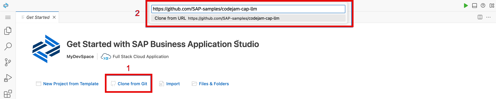

# Exercise 00 - Set up your workspace

At the end of this exercise, you'll have an environment to work in for the duration of this CodeJam, and your environment of choice will load the contents of this repository.

## Set up the environment and clone this repository

To prepare the building blocks for this CodeJam, you'll need to clone this CodeJam repository and make its contents available in the workspace you chose. Your workspace will be a Dev Space in the SAP Business Application Studio or alternatively you can use VS Code with a dev container. Our recommendation for this workshop is to go with the SAP Business Application Studio approach.

Follow one of the two subsections here, as appropriate: either for a [primary environment](#primary-environment-a-dev-space-in-the-sap-business-application-studio) or for an [alternative environment](#alternative-environment-vs-code-and-a-container-image).

### Primary environment: A Dev Space in the SAP Business Application Studio

#### Create a Dev Space

👉 Via this [link](https://cap-ai-codejam-op6zhda1.us10cf.applicationstudio.cloud.sap/) to the SAP Business Application Studio, create a new Dev Space, choosing the **Full Stack Cloud Application** type, ensure to select **SAP HANA Tools**, and if **SAP HANA Database Explorer** gets selected as well this is not a problem:


Choosing the **Full Stack Cloud Application** brings in some predefined extensions, as you can see from the screenshot, including a CDS Graphical Modeler and the CAP Tools. The **SAP HANA Tools** will allow you to interact with, deploy, and observe the SAP HANA Cloud instance that you will be using for working with the SAP HANA Cloud Vector Engine.

#### Clone this repository

👉 If the Dev Space is started and you're in it, use the **Clone from Git** option in the **Get Started** screen that appears to clone this repository. Follow the subsequent prompts to open the cloned repository; specify `https://github.com/SAP-samples/codejam-cap-llm.git` as the URL.



Your Dev Space will reload after the repository is cloned.

### Alternative environment: VS Code and a container image

_Follow the **Primary environment** section above if you want to use a Dev Space in the SAP Business Application Studio._

👉 At a command prompt on your local machine, clone this repository into a directory of your choice, and then open VS Code, pointing to that newly cloned repository's directory:

```bash
git clone https://github.com/SAP-samples/codejam-cap-llm
code codejam-cap-llm
```

Once VS Code has started and opened the directory, it should notice the [dev container configuration file](../../.devcontainer/devcontainer.json) (in the [.devcontainer/](../../.devcontainer/) directory) and ask you if you want to reopen everything in a container, as shown in the screenshot. Confirm that you wish to do so by selecting the default answer, **Reopen in Container.**

> If this doesn't happen, check that you have the Dev Containers extension in VS Code - see the [corresponding prerequisites section](../../prerequisites.md#alternative-environment-vs-code-with-a-dev-container) section for details. You might also need to explicitly request this action, by opening the Command Palette and selecting **Dev Containers: Reopen in container**.


## Navigate to the project folder

To work through the exercises make sure you are in the project folder. To do so, use the terminal to change directory into `codejam-cap-llm/project/job-posting-service/`.

👉 From the root of the CodeJam repository `/home/user/projects/codejam-cap-llm` change the directory:

```bash
cd project/job-posting-service
```

The SAP Business Application Studio will add a dependency to the `package.json` which you are not going to use in this workshop. This dependency needs to be removed.

👉 Open the `package.json`.

👉 Find the `@cap-js/hana` dependency and remove it.

👉 For this project, remove the following block from the `cds section` of the `packaege.json`:

```JSON
"sql": {
  "native_hana_associations": false
},
```

👉 Save the file.

There are two SAP HANA CDS adapter packages out there, one is the `@cap-js/hana` and the other is the `@sap/cds-hana`. The first one is just a newer unified database model package.

## Check the installation of the CDS development kit

_This and subsequent steps apply to both the primary and alternative environments._

👉 Inside your dev container or your Dev Space, open a terminal using **Terminal: Create New Terminal** in the Command Palette, and at the prompt, check the version:

```bash
cds v
```

You should see that the CDS development kit is installed. Depending on your workspace, you'll see slightly different output, but it should generally look something like this:

```text
@cap-js/cds-types: 0.2.0
@sap/cds: 7.6.1
@sap/cds-compiler: 4.4.4
@sap/cds-dk: 7.5.1
@sap/cds-dk (global): 7.5.1
@sap/cds-fiori: 1.2.2
@sap/cds-foss: 5.0.0
@sap/cds-mtxs: 1.15.0
@sap/eslint-plugin-cds: 2.6.5
Node.js: v18.14.2
home: /managed-content/globals/pnpm/5/.pnpm/@sap+cds@7.6.1_express@4.18.2/node_modules/@sap/cds
```

> In case `cds` is not installed, run the following command from the Terminal:
>
```bash
npm i @sap/cds-dk -g
```

## Install the NPM package dependencies

You'll work primarily within the `project/job-posting-service` directory of this repo, which contains a starter CAP project with code already written to provide UI and some of the service functionalities to make the CodeJam experience more accessible. The `package.json` file contains runtime and design-time dependencies.

👉 Make sure you're in the `project/job-posting-service` directory (where `package.json` lives):

👉 Now install the dependencies thus:

```bash
npm install
```

You can double-check what's installed with `npm list`, which should show you something similar to this:

```text
job-posting-service@1.0.0 /Users/Developer/GitHub/codejam-cap-llm/project/job-posting-service
├── @cap-js/sqlite@1.7.3
├── @sap-cloud-sdk/http-client@3.16.0
├── @sap/cds-dk@7.9.5
├── @sap/cds-hana@2.0.0
├── @sap/cds@7.9.3
├── @sap-ai-sdk/langchain@1.6.0
├── @sap-ai-sdk/orchestration@1.6.0
├── @langchain/community@0.3.11
├── @langchain/textsplitters@0.1.0
├── express@4.19.2
└── langchain@0.1.37
```

No worries, we will talk about these dependencies later.

## Summary

At this point, you have an environment set up to work through the remaining exercises in this CodeJam, along with the repository contents and the CDS development kit installed and ready for use.

## Further reading

* [Developing CAP in containers - three ways](https://qmacro.org/blog/posts/2024/01/15/developing-cap-in-containers-three-ways/)
* [Developing inside a Container](https://code.visualstudio.com/docs/devcontainers/containers)
* [Cloning repositories](https://help.sap.com/docs/SAP%20Business%20Application%20Studio/9d1db9835307451daa8c930fbd9ab264/7a68bfa7111b44f6b1e78b51e803238c.html) in SAP Business Application Studio
* [The @sap/cds-dk package on NPM](https://www.npmjs.com/package/@sap/cds-dk)

---

[Next exercise](../01-deploy-llm-ailaunchpad/README.md)
