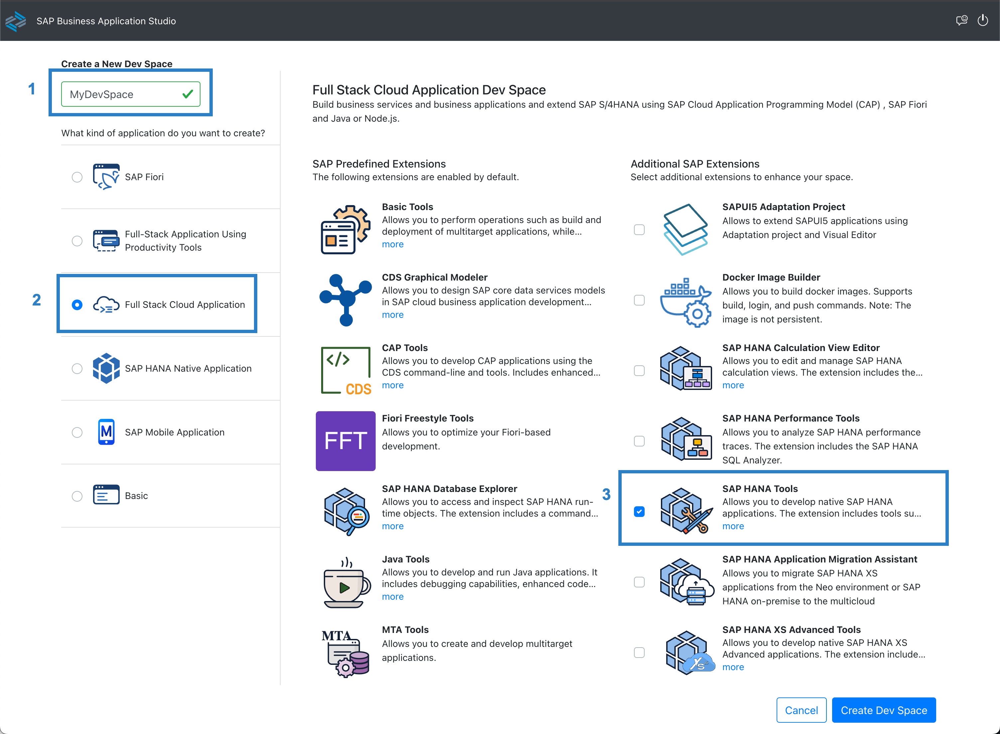
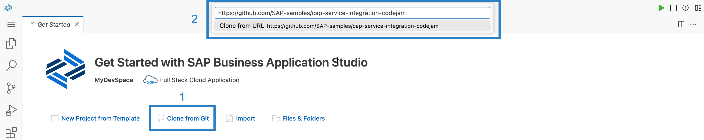

<link rel="stylesheet" href="../../assets/style.css">

# Exercise 01 - Set up your workspace

At the end of this exercise, you'll have an environment to work in for the duration of this CodeJam, and your environment of choice will load the contents of this repository.

## Set up the environment and clone this repository

To prepare the building blocks for this CodeJam, you'll need to clone this CodeJam repository and make its contents available in the workspace you chose in the [prerequisites](../../prerequisites.md). Your workspace will either be a Dev Space in the SAP Business Application Studio (the "primary environment") or VS Code with a dev container (the "alternative environment").

Follow one of the two subsections here, as appropriate: either for a [primary environment](#primary-environment-a-dev-space-in-the-sap-business-application-studio) or for an [alternative environment](#alternative-environment-vs-code-and-a-container-image).

### Primary environment: A Dev Space in the SAP Business Application Studio

_Follow the <b>Alternative environment</b> subsection below if you want to use VS Code and a container image._

#### Create a Dev Space

👉 Via your subscription to the SAP Business Application Studio, create a new Dev Space, choosing the <b>Full Stack Cloud Application</b> type, make sure to select <b>SAP HANA Tools</b>, and then make sure it's started up:



Choosing the <b>Full Stack Cloud Application</b> brings in some predefined extensions, as you can see from the screenshot, including a CDS Graphical Modeler and the CAP Tools. The <b>SAP HANA Tools</b>> will allow you to interact with, deploy, and observe the SAP HANA Cloud instance that you will be using for working with the SAP HANA Cloud Vector Engine.

> Depending on your subscription access, you may need to stop using existing Dev Spaces to use this one.

#### Clone this repository

👉 If the Dev Space is started and you're in it, use the <b>Clone from Git</b> option in the <b>Get Started</b> screen that appears to clone this repository. Follow the subsequent prompts to open the cloned repository; specify `https://github.com/SAP-samples/codejam-cap-llm.git` as the URL.



At this point, your Dev Space will restart.

### Alternative environment: VS Code and a container image

_Follow the <b>Primary environment</b> section above if you want to use a Dev Space in the SAP Business Application Studio._

👉 At a command prompt on your local machine, clone this repository into a directory of your choice, and then open VS Code, pointing to that newly cloned repository's directory:

```bash
git clone https://github.com/SAP-samples/codejam-cap-llm
code codejam-cap-llm
```

Once VS Code has started and opened the directory, it should notice the [dev container configuration file](../../.devcontainer/devcontainer.json) (in the [.devcontainer/](../../.devcontainer/) directory) and ask you if you want to reopen everything in a container, as shown in the screenshot. Confirm that you wish to do so by selecting the default answer <b>Reopen in Container.</b>

> If this doesn't happen, check that you have the Dev Containers extension in VS Code - see the [corresponding prerequisites section](../../prerequisites.md#alternative-environment-vs-code-with-a-dev-container) section for details. You might also need to explicitly request this action, by opening the Command Palette and selecting <b>Dev Containers: Reopen in container</b>.


At this stage, once VS Code has reopened, you need to do one more thing: both primary and alternative environments are aligned (and so that the instructions in this CodeJam content don't need to differ between them). When you use the <b>git clone</b> facility in a Dev Space, the repo is cloned into a directory called `projects/`, which itself lives in your home directory; in other words, it gets cloned to `/home/user/projects/<the-repo>.` The equivalent repo in a VS Code dev container will be in `/workspaces/<the-repo>`. So, let's align the repo location in your VS Code dev container environment to the Dev Space one.

👉 Create a `projects/` directory in your dev container user's home directory, and then create a symbolic link to the repo in there:

```shell
mkdir -p $HOME/projects/ \
  && ln -s /workspaces/codejam-cap-llm/ $HOME/projects/
```

> If the `projects/` directory already exists, for some reason, then the `mkdir` command would usually fail and emit a message; this would also mean that the subsequent `ln` command would not run (as they're connected via `&&`). So you can use the `-p` option to tell `mkdir` not to complain.

Ensure that everything is OK by checking that you can see the directories inside the repo via this new `projects/` directory in your dev container user's home directory. Here's an example of what you might expect to see:

```shell
$ find -L $HOME/projects -maxdepth 2 -type d
/home/node/projects
/home/node/projects/codejam-cap-llm
/home/node/projects/codejam-cap-llm/.devcontainer
/home/node/projects/codejam-cap-llm/.git
/home/node/projects/codejam-cap-llm/.github
/home/node/projects/codejam-cap-llm/.reuse
/home/node/projects/codejam-cap-llm/.vscode
/home/node/projects/codejam-cap-llm/LICENSES
/home/node/projects/codejam-cap-llm/assets
/home/node/projects/codejam-cap-llm/exercises
/home/node/projects/codejam-cap-llm/project
```

Now, you should be all set. You are ready to explore service integration with CAP in your dev container.

## Check the installation of the CDS development kit

_This and subsequent steps apply to both the primary and alternative environments._

👉 Inside your dev container or your Dev Space, open a terminal using <b>Terminal: Create New Terminal</b> in the Command Palette, and at the prompt, check the version:

```bash
cds v
```

You should see that the CDS development kit is installed. Depending on your workspace, you'll see slightly different output, but it should generally look something like this:

```text
@cap-js/cds-types: 0.2.0
@sap/cds: 7.6.1
@sap/cds-compiler: 4.4.4
@sap/cds-dk: 7.5.1
@sap/cds-dk (global): 7.5.1
@sap/cds-fiori: 1.2.2
@sap/cds-foss: 5.0.0
@sap/cds-mtxs: 1.15.0
@sap/eslint-plugin-cds: 2.6.5
Node.js: v18.14.2
home: /managed-content/globals/pnpm/5/.pnpm/@sap+cds@7.6.1_express@4.18.2/node_modules/@sap/cds
```

> The CDS development kit is installed as part of any <b>Full Stack Cloud Application</b> type of Dev Space in the SAP Business Application Studio. For the alternative environment, a RUN command in the [Dockerfile](../../.devcontainer/Dockerfile) is installed into the dev container.

## Install the NPM package dependencies

We'll work primarily within the `project/cap-documentation-ai-helper` directory of this repo, which contains a starter CAP project with code already written to provide UI and some of the service functionalities to make the CodeJam experience more accessible. The `package.json` file contains runtime and design time dependencies.

👉 Make sure you're in the `project/cap-documentation-ai-helper` directory (where `package.json` lives):

```bash
cd $HOME/projects/cap-llm-codejam/project/cap-documentation-ai-helper/
```

👉 Now install the dependencies thus:

```bash
npm install
```

You can double-check what's installed with `npm list`, which should show you something similar to this:

```text
cap-documentation-ai-helper@1.0.0 /Users/Developer/GitHub/codejam-cap-llm/project/cap-documentation-ai-helper
├── @cap-js/sqlite@1.7.3
├── @sap-cloud-sdk/http-client@3.16.0
├── @sap/cds-dk@7.9.5
├── @sap/cds-hana@2.0.0
├── @sap/cds@7.9.3
├── cap-llm-plugin@1.3.3
├── pdf-parse@1.1.1
├── express@4.19.2
└── langchain@0.1.37
```

No worries, we will talk about these dependencies later.

## Summary

At this point, you have an environment in which to work through the rest of the exercises in this CodeJam, the repository contents, and the CDS development kit installed and ready to use.

## Further reading

* [Developing CAP in containers - three ways](https://qmacro.org/blog/posts/2024/01/15/developing-cap-in-containers-three-ways/)
* [Developing inside a Container](https://code.visualstudio.com/docs/devcontainers/containers)
* [Cloning repositories](https://help.sap.com/docs/SAP%20Business%20Application%20Studio/9d1db9835307451daa8c930fbd9ab264/7a68bfa7111b44f6b1e78b51e803238c.html) in SAP Business Application Studio
* [The @sap/cds-dk package on NPM](https://www.npmjs.com/package/@sap/cds-dk)

---

[Next exercise](../02-deploy-llm-ailaunchpad/README.md)
