# Exercise 02 - Use SAP AI Launchpad to deploy a Large Language Model with Generative AI Hub on SAP AI Core

SAP AI Launchpad is a multi-tenant SaaS application on SAP BTP. You can use SAP AI Launchpad to manage AI use cases across different AI runtimes. SAP AI Launchpad also provides generative AI
capabilities via the Generative AI Hub and is available in the Cloud Foundry environment. You can also connect HANA as an AI runtime or the SAP AI Services, to work with HANA Predictive Analysis Library (PAL) or the SAP AI Service Data Attribute Recommendation.

## Open SAP AI Launchpad

👉 Go to your BTP subaccount **CAP AI CodeJam**.

👉 Navigate to **Instances and Subscriptions** and select **SAP AI Launchpad** from Subscriptions to open SAP AI Launchpad.

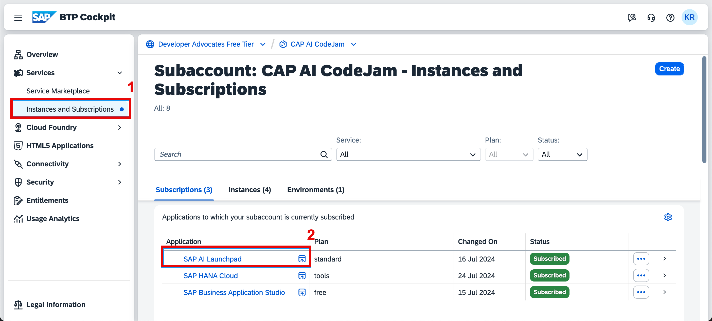

## Create a new resource group for your team

SAP AI Core tenants use resource groups to isolate AI resources and workloads. Scenarios (e.g. `foundation-models`)
and executables (a template for training a model or creation of a deployment) are shared across all resource groups.

> Make sure to create a **NEW** resource group for your team.</br> DO NOT USE THE DEFAULT RESOURCE GROUP!

👉 Open the **SAP AI Core Administration** tab and select **Resource Groups**.

👉 **Create** a new resource group with your team's name.

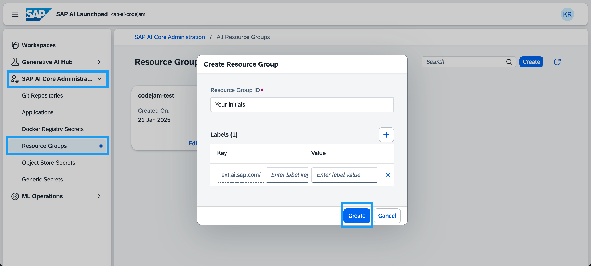

👉 Go back to **Workspaces**.

👉 Select your connection and your resource group.

👉 Make sure it is selected. It should show up at the top next to SAP AI Launchpad.

> You will need the name of your resource group in [Exercise 09-create-connection-configuration](../09-create-connection-configuration/README.md).

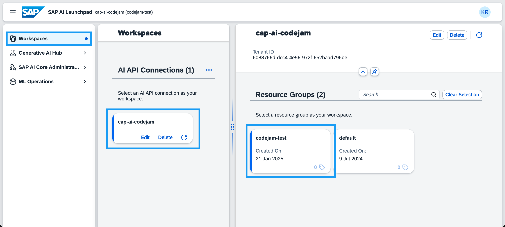

## Create a configuration to deploy a proxy for a large language model on SAP AI Core

With Generative AI Hub on SAP AI Core you have access to all major large language models (LLMs). There are open-source models that SAP has deployed such as the Falcon model. And there are models that SAP is a proxy for, such as the GPT models, Google models, models provided by Amazon Bedrock and more. To use one of the provided LLMs for a custom use case you need to create a deployment configuration of the model. Using the configuration you can then deploy the model. You will get a deployment URL that is created for you to query the model of your choice.

👉 Open the **ML Operations** tab.

👉 Go to **Scenarios**.

👉 Select the **foundation-models** scenario.
Scenarios related to generative AI are the only pre-configured scenarios provided by SAP. For all other custom machine learning models you would want to train or deploy you will need to create your own scenario.


👉 Select the **Executables** tab.

👉 Select the **serving executable azure-openai** to see the available Azure OpenAI models.

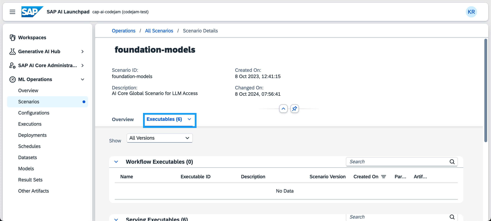

👉 Copy the name of the model you want to deploy the proxy for.

For this CodeJam you will use `gpt-4o-mini`.
After that you will create a configuration.

👉 Click on **Configurations**.

👉 **Create** a new configuration.

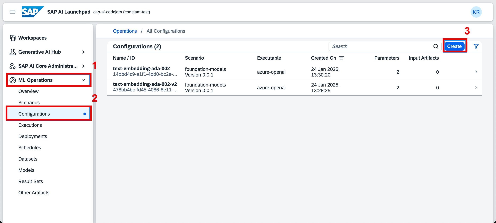

👉 Enter a configuration name e.g. `conf-gpt-4o-mini`, select the **foundation-models** scenario, version and the executable **azure-openai**.

👉 Click **Next**.

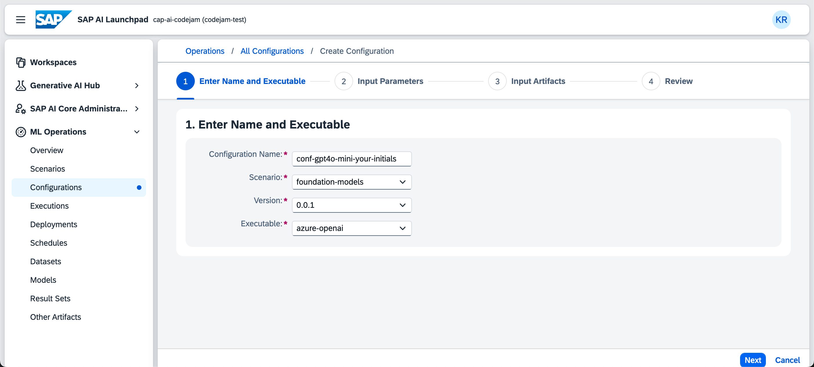

👉 Paste the model name `gpt-4o-mini` into the **modelName** field and click **Next**.

```
gpt-4o-mini
```

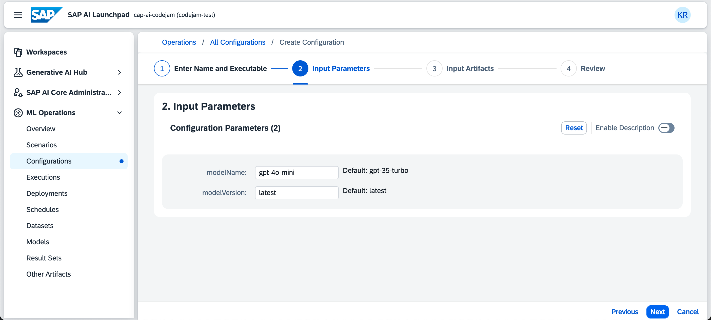

👉 Click **Review** on the bottom of the page.

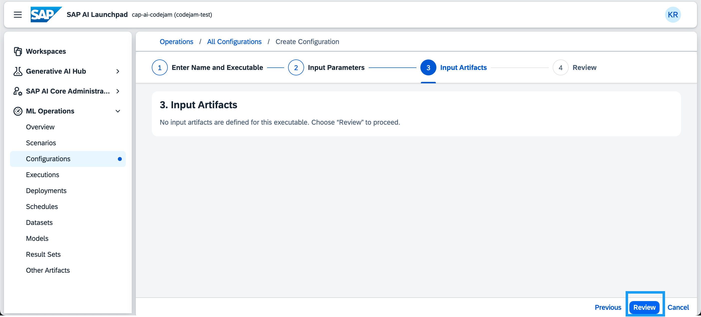

👉 Review the configuration and click **Create**.

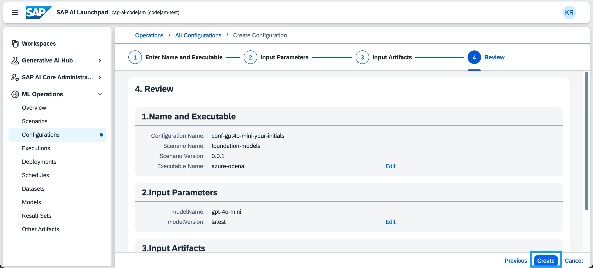

## Deploy a proxy for a large language model on SAP AI Core

👉 Click on **Create Deployment** to create a deployment for that configuration.
This will not actually deploy the model but it will deploy a proxy that will return a URL for you to use to query the LLM you specified in the configuration.

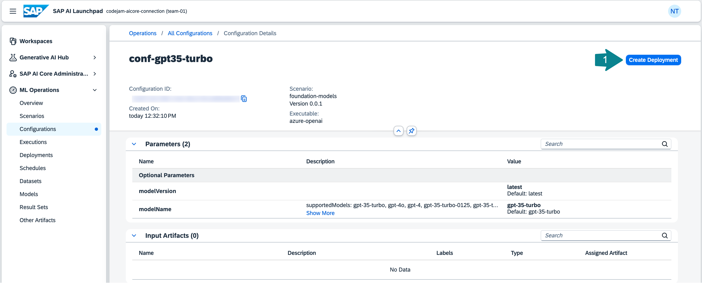

👉 For the duration select **Standard**.

You can also select **Custom** to have the deployment available for a limited time.

👉 Click **Review**.


👉 Click **Create**.

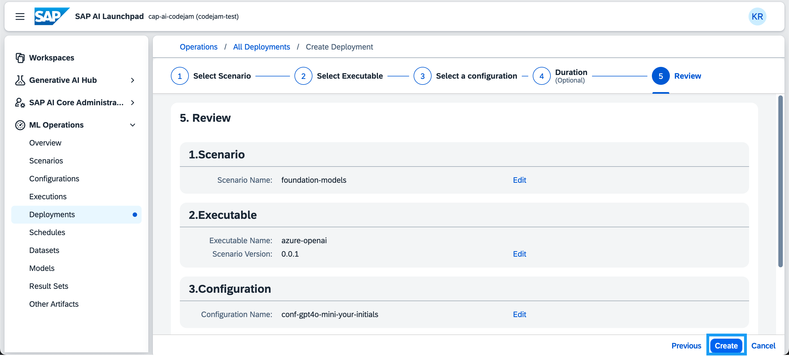

The deployment status is going to change from `UNKNOWN` to `PENDING` and then to `RUNNING`. Once the deployment is running you will receive a URL to query the model. Wait a couple of minutes, then **refresh** the page for the URL to appear.

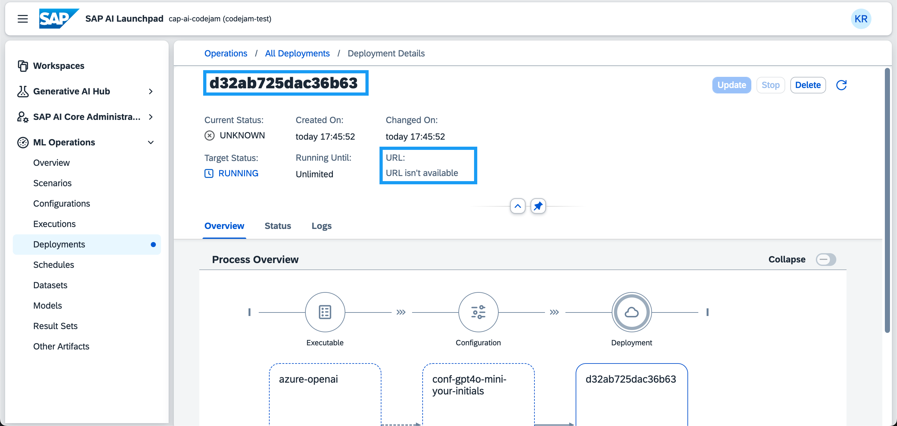

Using the `URL`, the `client id` and the `client secret` from the SAP AI Core service key, you could now already query the model using any programming language or any API platform.

## Deploy a proxy for an embedding model on SAP AI Core

👉 To implement a retrieval augmented generation (RAG) use case we also need to deploy an embedding model. The embeddings for our text chunks will then be stored in a vector database (e.g. [SAP HANA Cloud Vector Engine](https://help.sap.com/docs/hana-cloud-database/sap-hana-cloud-sap-hana-database-vector-engine-guide/sap-hana-cloud-sap-hana-database-vector-engine-guide)).

To deploy the embedding model repeat the steps above using the model name `text-embedding-ada-002` instead of `gpt-4o-mini`:

```
text-embedding-ada-002
```

## Summary

At this point, you will have learned how to create your own resource group, which models are available via Generative AI Hub and deploy LLMs in SAP AI Launchpad.

## Further reading

- [SAP AI Launchpad - Help Portal (Documentation)](https://help.sap.com/docs/ai-launchpad/sap-ai-launchpad/what-is-sap-ai-launchpad)
- [SAP AI Core Terminology](https://help.sap.com/docs/sap-ai-core/sap-ai-core-service-guide/terminology)
- [Available Models in the Generative AI Hub](https://help.sap.com/docs/sap-ai-core/sap-ai-core-service-guide/models-and-scenarios-in-generative-ai-hub)

---

[Next exercise](../03-explore-genai-hub/README.md)
