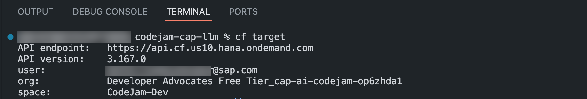
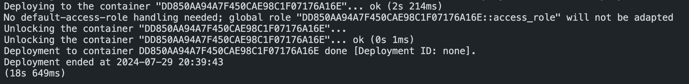
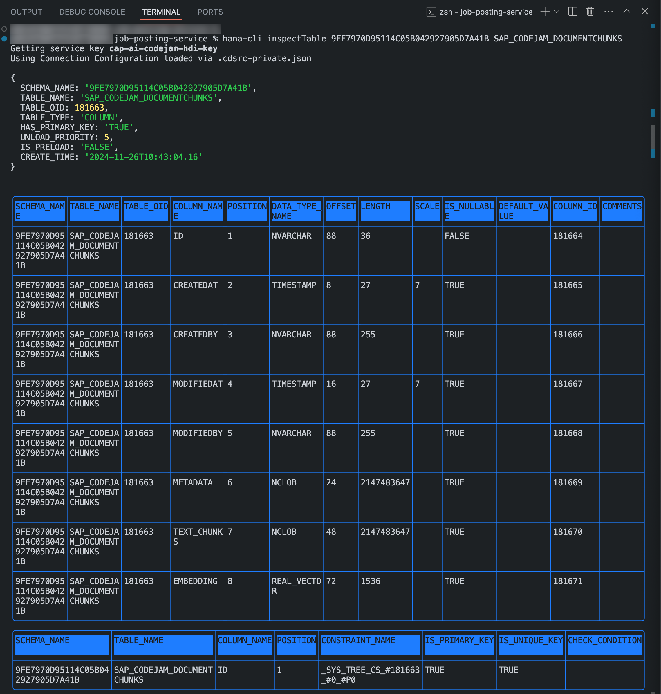

# Exercise 04 - Create the database schema for the CAP application

_Estimated Time: **15 - 30 min**_

The repository you have cloned provides a skeleton project in the project directory (../../project/job-posting-service/). The skeleton project contains an already-set-up CAP application with the fully configured [package.json](../../project/job-posting-service/package.json) and supporting files for the following exercises.

In this exercise you will learn:

- How to explore the `package.json` and its contents.
- How to define the database schema for the SAP HANA Cloud database.
- How to build and deploy the schema to your HDI container.

## Table of Contents

- [Explore the package.json file and its contents](#explore-the-packagejson-file-and-its-contents)
- [Define the database schema](#define-the-database-schema)
- [Build and deploy the schema to your HDI container](#build-and-deploy-the-schema-to-your-hdi-container)
- [Examine the database table](#examine-the-database-table)
- [Summary](#summary)
  - [Questions for Discussion](#questions-for-discussion)
- [Further reading](#further-reading)

## Explore the package.json file and its contents

The `package.json` file includes all Node.js project-specific configurations like project name, version, dependencies, and run scripts but also CDS-specific configurations like the HANA runtime information.

👉 Open the `package.json` file.

👉 Examine the dependencies. Notice that there is a dependency for `"@sap-ai-sdk/orchestration": "2.3.0"` and the `"@sap-ai-sdk/langchain": "2.3.0"`.

The SAP Cloud SDK for AI provides four different packages for you to use depending on your use case.

- **[@sap-ai-sdk/orchestration](https://github.com/SAP/ai-sdk-js/tree/35c048e3f73ff2487c72d36369e96b3e143c5d13?tab=readme-ov-file#sap-ai-sdkorchestration)**: The orchestration package incorporates generative AI orchestration capabilities into your AI activities in SAP AI Core and SAP AI Launchpad.
- **[@sap-ai-sdk/langchain](https://github.com/SAP/ai-sdk-js/tree/35c048e3f73ff2487c72d36369e96b3e143c5d13?tab=readme-ov-file#sap-ai-sdklangchain)**: The langchain package provides LangChain model clients, built on top of the foundation model clients of the SAP Cloud SDK for AI.
- **[@sap-ai-sdk/foundation-models](https://github.com/SAP/ai-sdk-js/tree/35c048e3f73ff2487c72d36369e96b3e143c5d13?tab=readme-ov-file#sap-ai-sdkfoundation-models)**: The foundation models package incorporates generative AI foundation models into your AI activities in SAP AI Core and SAP AI Launchpad.
- **[@sap-ai-sdk/ai-api](https://github.com/SAP/ai-sdk-js/tree/35c048e3f73ff2487c72d36369e96b3e143c5d13?tab=readme-ov-file#sap-ai-sdkai-api)**: The AI SDK API package provides tools to manage your scenarios and workflows in SAP AI Core.

In addition, the `package.json` allows you to define run scripts a sort of alias for more complex commands.

👉 Examine the listed scripts.

- `build_production` : Runs the `cds build` command to build the CAP project for production.
- `start` : Starts the CAP application.
- `watch_hybrid` : Deploys your changes specific to your service to localhost using the hybrid profile, establishing a connection to your real HDI container instance.

## Define the database schema

Within a CAP application, you can define a database schema that can be built into HANA database artifacts. The artifacts can be deployed to a bound HDI container, which will cause the creation of the database tables, relationships, views, and any other HANA database artifacts.

For this project, the schema has two entities; `DocumentChunks` and `JobPostings`.

The `DocumentChunks` entity contains the text chunks, embeddings for the provided context information and relevant metadata. In the exercise [07 - Define the Job Posting Service](../07-define-job-posting-service/README.md), you will define a service for creating and deleting job postings. You will use a chat model to create job postings for specific job specifications and in exercise [06 - Create Vector embeddings](../06-create-vector-embeddings/README.md) use an embedding model to create vector embeddings providing additional business contextual information to the chat model. This information can then be used to generate an accurate job posting utilizing internal company specific information.

👉 Open the `schema.cds` file under the `db` directory.

👉 In the file define a namespace `sap.codejam`:

```cds
namespace sap.codejam;
```

The namespace allows for better identification and provides uniqueness to the entities within that namespace. It also will cause the database table to be named `SAP_CODEJAM_<Entity Name>` in example `SAP_CODEJAM_DOCUMENTCHUNK`.

👉 Right below, add the following line of code:

```cds
using {
    cuid,
    managed
} from '@sap/cds/common';
```

The entity should be managed, meaning it will utilize `cuid` to auto-generate a `UUID`, create time stamps for creation and mutation of the table entries including auditing.

👉 Add an entity to store job postings in the database. You will utilize this entity in a later exercise by using AI to generate job postings and store them in the corresponding table.

```cds
entity JobPosting : cuid, managed {
    user_query   : String;
    rag_response : String;
}
```

The entity defines two fields:

- `user_query`: Stores the incoming user query.
- `rag_response` : Stores the response from the chat model.

👉 Lastly, add the definition for the `DocumentChunk` entity. The entity is using the `managed` and `cuid` features from the `cds.common` package.

```cds
entity DocumentChunk : cuid, managed {
    metadata    : LargeString;
    text_chunk : LargeString;
    embedding   : Vector(1536);
}
```

The entity defines three fields:

- `metadata`: Stores the path to the information document. The document is a PDF that includes business contextual information.
- `text_chunk` : Stores the individual-created text chunks.
- `embedding` : Stores the encoded vector embeddings created by an embedding model.

👉 Save the file.

The complete `schema.cds` should look like this now:

```cds
namespace sap.codejam;

using {
    cuid,
    managed
} from '@sap/cds/common';

entity DocumentChunk : cuid, managed {
    metadata   : LargeString;
    text_chunk : LargeString;
    embedding  : Vector(1536);
}

entity JobPosting : cuid, managed {
    user_query   : String;
    rag_response : String;
}

```

## Build and deploy the schema to your HDI container

Because you created a binding to our HDI container, you have all configurations in place to deploy HANA database artifacts to the instance. To do so you need to build the artifacts first enter the `cds deploy` command.

👉 Make sure that you are still connected to the Cloud Foundry instance by checking the connection details:

```bash
cf target
```



If the reply from the CLI tells you to log in again simply enter `cf login`.

```bash
cf login
```

👉 Build the project first by calling the `cds build --production` command.

```bash
cds build --production
```

👉 To deploy the build db artifacts in the `.gen` folder, call the `cds deploy --to hana:<hdi-instance>` command **(Use the HDI container name you defined in Exercise 03)**.

> In case you forgot your HDI container name, you can simply call `cf services` to get a list of all available service instances including your HDI container.

```bash
cds deploy --to hana:<use-your-own-HDI-container-name > --auto-undeploy
```

The `--auto-undeploy` argument causes the database to adjust to the new runtime definition of your database artifacts.
Be aware that the command will create another service key for deployment to the HDI container. This is okay as you are using the binding for connection to the HDI container from within the CAP application.

You will see a large terminal output listing the different steps of the building and deployment process.



Great! The database is initialized, and the table with all necessary fields is created.

## Examine the database table

There are multiple ways of viewing your database artifacts on SAP HANA Cloud. One would be to use the **SAP HANA Database Explorer** and, of course, the CLI if you don't want to use the UI. If you are interested in using the **SAP HANA Database Explorer**, you will find a tutorial in the **Further Reading** section. You should use the CLI today because it is faster. `#TheFutureIsTerminal`

You have to install the [hana-cli](https://github.com/SAP-samples/hana-developer-cli-tool-example?tab=readme-ov-file#requirements--download-and-installation) first.

👉 Open a new terminal or use an existing one.

👉 Run the install command:

```bash
npm install -g hana-cli
```

> Note that you install the HANA CLI globally here. You can always install the CLI for the project only and remmove the `-g` argument. If you want to use the HANA CLI in multiple projects it makes sense to install it globally.

👉 Enter the `hana-cli help` command to get a list of all available commands:

```bash
hana-cli help
```

👉 To get a list of all available tables within your HDI container you can execute the following command:

```bash
hana-cli tables
```


From the response, you can extract the schema name and the table name. You will use the information to fetch all information about that table. Be aware, sometimes if you copy the schema and table name from the previous CLI response it might add special characters which are not part of the name. You need to delete them.

👉 Enter the following command to list the table information:

```bash
hana-cli inspectTable <your-schema-name> SAP_CODEJAM_DOCUMENTCHUNKS
```



You can see all created fields as defined in the [schema.cds](../../project/cap-documentation-ai-helper/db/schema.cds). Notice that it also has all the fields from the `managed` feature from the `cds.common` package.

👉 Go ahead and try inspecting the job postings table.

## Summary

At this point, you have learned how to define a database schema using CDS, how to build and deploy database artifacts, and how you can use the hana-cli to inspect your database tables.

### Questions for Discussion

1. How do you define a database schema in a CAP application, and what entities are included in this exercise?

<details><summary>Answer</summary>
   In a CAP application, you define the database schema using a schema.cds file. This file specifies the entities that represent database tables, their fields, and relationships. In this exercise, two key entities are defined:

- **DocumentChunks**: Stores text chunks, vector embeddings, and relevant metadata for business context.
- **JobPostings**: Stores job posting data, including the user query and the response generated by a chat model.

   </details>

2. What is the command to build and deploy the database schema to the HDI container, and what steps must you follow?

<details><summary>Answer</summary>
   To build and deploy the database schema to the HDI container, follow these steps:

1.  Build the project with the command:

```bash
cds build --production
```

2.  Deploy the database artifacts using:

```bash
 cds deploy --to hana:<your-hdi-container-name> --auto-undeploy
```

The `--auto-undeploy` flag ensures that the database is updated according to the new schema.

   </details>

3. How can you inspect the deployed database tables in your HDI container using the CLI?

<details><summary>Answer</summary>
   You can inspect the deployed database tables using the hana-cli tool. After installing it, follow these steps:

1.  Run the command to view available tables::

```bash
hana-cli tables
```

2.  To inspect a specific table, such as the DocumentChunks table, use:

```bash
 hana-cli inspectTable <Your-schema-name> SAP_CODEJAM_DOCUMENTCHUNKS
```

This will display the schema and fields of the DocumentChunks table, allowing you to verify the deployment. You can also inspect the JobPostings table in a similar manner.

   </details>

## Further reading

- [hana-cli commands](https://github.com/SAP-samples/hana-developer-cli-tool-example?tab=readme-ov-file#commands)
- [Deploying to SAP HANA](https://cap.cloud.sap/docs/guides/databases-hana#deploying-to-sap-hana)
- [Deploy to SAP HANA - Tutorial](https://developers.sap.com/tutorials/hana-cloud-deploying..html)

---

[Next exercise](../05-create-vector-embeddings/README.md)
