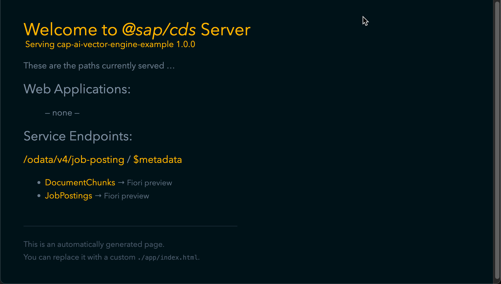

# Exercise 05 - Create vector embeddings using an embedding model

_Estimated Time: **30 - 45 min**_

In this exercise you will get a quick introduction to vector embeddings and you will learn:

- What vector embeddings are.
- How to create them.
- How to store them in the SAP HANA Cloud Vector Engine.

## Table of Contents

- [Exercise 05 - Create vector embeddings using an embedding model](#exercise-05---create-vector-embeddings-using-an-embedding-model)
  - [Table of Contents](#table-of-contents)
  - [What is a vector embedding?](#what-is-a-vector-embedding)
  - [Define a simple OData endpoint to trigger the creation of vector embeddings](#define-a-simple-odata-endpoint-to-trigger-the-creation-of-vector-embeddings)
  - [Implement the creation of vector embeddings](#implement-the-creation-of-vector-embeddings)
  - [Implement the creation of vector embedding entries](#implement-the-creation-of-vector-embedding-entries)
  - [Implement the insertion of the vector embedding entries](#implement-the-insertion-of-the-vector-embedding-entries)
  - [Implement the deletion for the vector embeddings](#implement-the-deletion-for-the-vector-embeddings)
  - [Create some vector embeddings](#create-some-vector-embeddings)
  - [Summary](#summary)
    - [Questions for Discussion](#questions-for-discussion)
  - [Further reading](#further-reading)

## What is a vector embedding?

AI models operate on data in a purely mathematical manner. An AI model by itself needs unstructured data such as text, audio or images be represented in a numerical way for it to operate on that data. To bridge the gap between unstructured data and the required numerical format for the AI model, the data must be converted to a numeric form. Vector embeddings are a way to represent unstructured data in a multi-dimensional numeric way for the AI model to process.

To perform this transformation an embedding model can be used. These embedding models can be pre-trained on a great number of data sets or you can utilize a model by training it yourself. In any case the embedding model creates an output vector representing unstructured data with the goal of meaningful similarity. That means the vector embedding should represent the semantic meaning of the real-world data. This allows for the mathematical assumption that two vector embeddings, which are similar to each other, have a high probability of being similar to their real-world data representation. The same is true for data that is dissimilar.

Using an embedding model to create vector embeddings, a numerical representation of real-world unstructured data, can help provide contextual information to an AI model that, based on that numerical data, can provide a proper answer to a user's question.

This is what you will do in the following exercises. You will use unstructured data, transform it into many vector embeddings, storing them in the SAP HANA Cloud Vector Engine. These vector embeddings than get compared to a vector embedding containing the user's questions using a mathematical algorithm. This comparison should return a vector embedding most similar to the numerical representation of the user's query. The resulting vector embedding's real-world data can now be used to provide contextual information to a chat model to retrieve a fitting answer to the user's query.

You can use two different algorithms for creating a comparison between vector embeddings:

- Euclidean distance measures the average linear distance between the different vectors.

- Cosine distance measures the cosine of the angle between two vectors. The result is between -1 and 1 whereas 1 represents complete similarity between two vectors, -1 the complete opposite and 0 that the two vectors are unrelated.

These two algorithms are different in the way of how they calculate the actual distance between two vectors. The closer the distance, the higher the probability of similarity.

If you are interested in the mathematical representation of these two algorithms, read an interesting article on the topic in the **Further Reading** section.

An easy approach to which algorithm to use is to simply try them both out and see what algorithm provides a better result.

## Define a simple OData endpoint to trigger the creation of vector embeddings

You will define two OData endpoints in the provided cds file. These two endpoints are provided to help you trigger the creation and deletion of vector embeddings during this workshop. You can definetely create vector embeddings outside of such a project and pre-populate your HANA database. This can be done via code or via the SAP generative AI Hub. For this workshop, I want you to do this on your own within this project so you get a good understanding on how this works.

👉 Open the `job-posting-service.cds` file from the `srv` folder.

You want to expose the entities `DocumentChunk` as well as the `JobPosting` via your OData service. To do so, you need a reference to the schema definition.

👉 Add the following line of code to create the reference to the schema definition:

```CDS
using {sap.codejam as db} from '../db/schema';
```

👉 Create the service definition:

```CDS
service JobPostingService {
      // implementation goes here...
}
```

Within the service definition you want to expose the before-mentioned entities. The `DocumentChunk` entity has a field containing the actual embeddings. These embeddings are of type `cds.Vector`. The OData specification doesn't know the type `cds.Vector` and so can't expose it via the OData service. For some custom types defined by CDS it is possible to create a mapping to OData types, but not in this case. There is no corresponding OData type you could map `cds.Vector` to, that means you have to exclude this field from the OData service.

👉 Within the service definition, add an entity projection for `DocumentChunk`:

```CDS
entity DocumentChunk as
      projection on db.DocumentChunk
      excluding {
          embedding
      }
      actions {
          // Bound to collection - operates on all document chunks
          action deleteAll(in: many $self) returns StatusResponse;
      }
```

👉 Right below the `DocumentChunk` entity, add a projection for the `JobPosting` entity:

```CDS
entity JobPosting as projection on db.JobPosting;
```

Great! You got both entities projected in the OData service. The bound actions are just there to be able to delete the entities if needed.
Now, you implement two unbound actions in your service. One for creation of vector embeddings and one for the creation of job postings.

👉 Add an action definitions right below the `JobPosting` entity projection:

```CDS
action createVectorEmbeddings()                      returns VectorEmbeddingResult;
```

Each of these actions return custom types which help to have a more structured return.
Right below the first line in the file add the following types: `StatusResponse` and `VectorEmbeddingResult`

```CDS
// Type definitions for structured returns
type StatusResponse {
    success : Boolean;
    message : String;
}

type VectorEmbeddingResult {
    count   : Integer;
    chunks  : Integer;
    message : String;
}
```

The `job-posting-service.cds` should look like this now:

```CDS
using {sap.codejam as db} from '../db/schema';

// Type definitions for structured returns
type StatusResponse {
    success : Boolean;
    message : String;
}

type VectorEmbeddingResult {
    count   : Integer;
    chunks  : Integer;
    message : String;
}

service JobPostingService {
    entity DocumentChunk as
        projection on db.DocumentChunk
        excluding {
            embedding
        }
        actions {
            // Bound to collection - operates on all document chunks
            action deleteAll(in: many $self) returns StatusResponse;
        };

    entity JobPosting    as projection on db.JobPosting
        actions {
            // Bound to specific instance - delete this job posting
            action deleteJobPosting()        returns StatusResponse;
            // Bound to collection - delete all job postings
            action deleteAll(in: many $self) returns StatusResponse;
        };

    // Unbound actions for operations not tied to a specific entity
    action createVectorEmbeddings()                      returns VectorEmbeddingResult;
    action createJobPosting(user_query: String not null) returns JobPosting;
}
```

## Implement the creation of vector embeddings

To achieve a more clean code structure, you will implement most of the business logic in separate files achieving separation of concerns. The separation will be treated lightly, so you will only create two separate files, one for handling all AI relevant tasks, and one for handling all database related tasks. The project provides you with the two files that are currently empty: `AIHelper` and `DBUtils`.

You will implement the handlers, and you will call logic from within the `AIHelper` and the `DBUtils`. You will jump back and forth between these files to implement the needed business logic.

The SDK uses ES6 for module loading which means that you need to export the function implementations differently compared to what you are used to using CAP. For this Codejam, you can simply use the `export default function()` approach.

👉 Open the `job-posting-service.js` file from the `srv` folder.

👉 First, import the `AIHelper` and `DBUtils` files to have access to the functions within. You will implement the functions step-by-step throughout the exercises:

```JavaScript
import * as AIHelper from './helper/ai-helper.js';
import * as DBUtils from './helper/db-utils.js';
```

Let's implement the different handlers.

👉 Add the following code block to the file:

```JavaScript
export default function () {
  // implementation goes here ...
}
```

👉 In the code block add the following handler for the creation of vector embeddings:

```JavaScript
this.on('createVectorEmbeddings', async req => {
  // implementation goes here
});

```

👉 In the `createVectorEmbeddings()` handler, implement the following lines of code calling the creation of the vector embeddings from the `AIHelper` and store the result from this call in the database.

```JavaScript
const embeddings = await AIHelper.createVectorEmbeddings();
const embeddingEntries = await DBUtils.createEmbeddingEntries(embeddings);
await DBUtils.insertVectorEmbeddings(embeddingEntries);

return {
    count: embeddingEntries.length,
    chunks: embeddingEntries.length,
    message: 'Vector embeddings created and stored in database'
};
```

Your function should look like this now:

```JavaScript
this.on('createVectorEmbeddings', async () => {
    const embeddings = await AIHelper.createVectorEmbeddings();
    const embeddingEntries = await DBUtils.createEmbeddingEntries(embeddings);
    await DBUtils.insertVectorEmbeddings(embeddingEntries);

    return {
      count: embeddingEntries.length,
      chunks: embeddingEntries.length,
      message: 'Vector embeddings created and stored in database'
    };
});
```

👉 Implement the `deleteAll` bound action on the Document Chunk entity next:

```JavaScript
this.on('deleteAll', 'DocumentChunk', async (req) => {
  const result = await DBUtils.deleteVectorEmbeddings();

  return {
    success: true,
    message: result
  };
});
```

The `job-posting-service.js` should look like this now:

```JavaScript
import * as AIHelper from './helper/ai-helper.js';
import * as DBUtils from './helper/db-utils.js';

export default function () {
  this.on('createVectorEmbeddings', async () => {
    const embeddings = await AIHelper.createVectorEmbeddings();
    const embeddingEntries = await DBUtils.createEmbeddingEntries(embeddings);
    await DBUtils.insertVectorEmbeddings(embeddingEntries);

    return {
      count: embeddingEntries.length,
      chunks: embeddingEntries.length,
      message: 'Vector embeddings created and stored in database'
    };
  });

  this.on('deleteAll', 'DocumentChunk', async (req) => {
    const result = await DBUtils.deleteVectorEmbeddings();

    return {
      success: true,
      message: result
    };
  });
}
```

This code won't execute as of now, because the corresponding functions are not defined nor implemented in the `AIHelper` and `DBUtils`. You will do this now.

👉 Open the `ai-helper.js` file from the `srv/helper` folder.

Within the file you need to import the embedding client from the `@sap-ai-sdk/langchain` package.

👉 Add the following lines of code to the top of the file:

```JavaScript
import {
  AzureOpenAiEmbeddingClient,
} from '@sap-ai-sdk/langchain';
```

👉 Right below the import statement add the following constant containing the embedding model's name:

```JavaScript
const embeddingModelName = 'text-embedding-3-small';
```

You define the embedding model's name in a constant because you will use the name again at a later point. This gives you a single point of truth in case you want to change the chat model in the future.

👉 Do the same for the resource group:

```JavaScript
const resourceGroup = 'CAP-AI-Codejam';
```

To create vector embeddings, you need to read the contextual information file which in your case is a text document.

👉 Import a text loader from lanchain to read the needed document from file:

```JavaScript
import { TextLoader } from '@langchain/classic/document_loaders/fs/text';
```

👉 Import a text splitter for splitting up the text document into meaningful chunks for the embedding model to process into vector embeddings:

```JavaScript
import { RecursiveCharacterTextSplitter } from '@langchain/textsplitters';
```

👉 Import the path tool to make definition of the file path easier:

```JavaScript
import path from 'path';
```

You have all the APIs imported to read a text file, split it into meaningful chunks and send it to the embedding model. You will implement the `createVectorEmbedding()` function now.

👉 Add the following asynchronous function `createVectorEmbedding()`:

```JavaScript
async function createVectorEmbeddings() {
  try {
    // implementation goes here...
  } catch (error) {
     console.log(
      `Error while creating Vector Embeddings.
      Error: ${error.response}`
    );
    throw error;
  }
}
```

👉 Within the try block implement the loading of the text document:

```JavaScript
const loader = new TextLoader(path.resolve('db/data/demo_grounding.txt'));
const document = await loader.load();
```

The code is using Langchain's text loader to load the `demo_grounding.txt` file.

With the file at hand you will define the text splitter and use it to split up the text within the text document into the specified sizes. The size of a text chunk is defined in characters using the specified text splitter. To find a working chunk size is not easy, it takes experience as well as testing. In case the size is set to high or to low, the embeddings might not be as usable as you want them to be. You can soften the result and make them more appliable to also set a chunk overlap.

👉 Right below the document loading call, add the initialization of the `RecursiveCharacterTextSplitter`:

```JavaScript
const splitter = new RecursiveCharacterTextSplitter({
      chunkSize: 400,           // Aim for ~400 characters/tokens
      chunkOverlap: 50,         // Include 50 chars of overlap to maintain context
      separators: ["\n\n", "\n", ".", " ", ""],  // Recursive priority: break by paragraph > line > sentence > word > char
    });
```

👉 Call the `splitDocuments()` call with the loaded document:

```JavaScript
const splitDocuments = await splitter.splitDocuments(document);
```

The objects returned by the text splitter are JSON objects that hold values under the key `pageContent`. This value are the text chunks. You need to extract these values to pass them to the embedding client.

👉 Implement a simple array loop to extract the values:

```JavaScript
const textSplits = [];
for (const chunk of splitDocuments) {
  textSplits.push(chunk.pageContent);
}
```

You need a way to feed the document splits to the embedding model. If you remember, you've deployed an embedding model to SAP AI Launchpad. You will use this model to create the vector embeddings. SAP has provided you with the SAP Cloud SDK for AI that allows you to utilize Langchain APIs that has been enhanced with SAP functionality like connectivity to SAP AI Launchpad. You will create an `AzureOpenAiEmbeddingClient`instance which can automatically connect to SAP AI Launchpad using a service binding or the `.env` file.

👉 Create the embedding client by adding the following code:

```JavaScript
const embeddingClient = new AzureOpenAiEmbeddingClient({
      modelName: embeddingModelName,
      maxRetries: 0,
      resourceGroup: resourceGroup
});
```

👉 Call the embedding client to embedd the document splits:

```JavaScript
const embeddings = await embeddingClient.embedDocuments(textSplits);
```

👉 Finally, return the embeddings, the document splits and the path. These values will be stored in the database in the `DocumentSplits` table. Add the following code:

```JavaScript
return [embeddings, splitDocuments];
```

Your complete implementation should look like this now:

```JavaScript
async function createVectorEmbeddings() {
  try {
    const loader = new TextLoader(path.resolve('db/data/demo_grounding.txt'));
    const document = await loader.load();

    const splitter = new RecursiveCharacterTextSplitter({
      chunkSize: 400,           // Aim for ~400 characters/tokens
      chunkOverlap: 50,         // Include 50 chars of overlap to maintain context
      separators: ["\n\n", "\n", ".", " ", ""],  // Recursive priority: break by paragraph > line > sentence > word > char
    });

    const splitDocuments = await splitter.splitDocuments(document);

    const textSplits = [];
    for (const chunk of splitDocuments) {
      textSplits.push(chunk.pageContent);
    }

    const embeddingClient = new AzureOpenAiEmbeddingClient({
      modelName: embeddingModelName,
      maxRetries: 0,
      resourceGroup: resourceGroup
    });
    const embeddings = await embeddingClient.embedDocuments(textSplits);

    return [embeddings, splitDocuments];
  } catch (error) {
    console.log(
      `Error while creating Vector Embeddings.
      Error: ${error.response}`
    );
    throw error;
  }
}
```

👉 Lastly, add the `createVectorEmbeddings` to the function export as last line to the `ai-helper.js` file:

```JavaScript
export { createVectorEmbeddings};
```

## Implement the creation of vector embedding entries

You are about to implement the storing of the generated vector embeddings to the SAP HANA Cloud Vector Engine.

👉 Open the `db-utils.js` file from the `srv/helper` folder.

👉 Add the following import statement to the top of the file:

```JavaScript
import cds from '@sap/cds';
```

👉 Add the following line of code to make SQL insert and delete querying available to you:

```JavaScript
const { INSERT, DELETE } = cds.ql;
```

👉 Add the following line of code to make the database entities available to you:

```JavaScript
const { JobPosting, DocumentChunk } = cds.entities;
```

To make your code easier to read, you will seperate the functionality of creating the embedding entries and the insertion to the database. You will utilize the `DocumentChunk` entity you have defined above to create the JSON object for database insertion.

👉 Define the `createEmbeddingEntries()` function:

```JavaScript
export function createEmbeddingEntries([embeddings, splitDocuments]) {
  // implementation goes here
}
```

👉 Within the function, define an array holding the different embedding entries:

```JavaScript
let embeddingEntries = [];
```

👉 Iterate over the embeddings and create a JSON object for each embedding in the list. Right below the previous line of code add the following:

```JavaScript
for (const [index, embedding] of embeddings.entries()) {
    const embeddingEntry = {
      metadata: splitDocuments[index].metadata.source,
      text_chunk: splitDocuments[index].pageContent,
      embedding: `[${embedding}]`
    };
    embeddingEntries.push(embeddingEntry);
  }
```

👉 As last line of the `insertVectorEmbeddings` return the embedding entry list:

```JavaScript
return embeddingEntries;
```

Your function implementation should look like this now:

```JavaScript
export function createEmbeddingEntries([embeddings, splitDocuments]) {
    let embeddingEntries = [];
    for (const [index, embedding] of embeddings.entries()) {
        const embeddingEntry = {
          metadata: splitDocuments[index].metadata.source,
          text_chunk: splitDocuments[index].pageContent,
          embedding: `[${embedding}]`
        };
        embeddingEntries.push(embeddingEntry);
      }
    return embeddingEntries;
}
```

## Implement the insertion of the vector embedding entries

The insertion into the database is simple. You use the CAP CQL syntax to insert all entries to the `DocumentChunk` table.

👉 Create the function `insertVectorEmbeddings` first:

```JavaScript
export async function insertVectorEmbeddings(embeddingEntries) {
  try {
    // implementation goes here
  } catch (error) {
    console.log(
      `Error while storing the vector embeddings to SAP HANA Cloud: ${error.toString()}`
    );
    throw error;
  }
}
```

👉 Create the code the database insertion within the try block:

```JavaScript
await INSERT.into(DocumentChunk).entries(embeddingEntries);

return `Embeddings inserted successfully to table.`;
```

The `insertVectorEmbeddings` should look like this now:

```JavaScript
export async function insertVectorEmbeddings(embeddingEntries) {
  try {
    await INSERT.into(DocumentChunk).entries(embeddingEntries);

    return `Embeddings inserted successfully to table.`;
  } catch (error) {
    console.log(
      `Error while storing the vector embeddings to SAP HANA Cloud: ${error.toString()}`
    );
    throw error;
  }
}
```

## Implement the deletion for the vector embeddings

You can create and insert vector embeddings, last step is to make it possible to delete vector embeddings.

👉 Right below the `insertVectorEmbeddings` function handler add the following code:

```JavaScript
export async function deleteVectorEmbeddings() {
  try {
    // implementation goes here
  } catch (error) {
    console.log(
      `Error while deleting Document Chunks: \n ${JSON.stringify(error.response)}`
    );
  }
}
```

👉 Within the `try` block add the following code:

```JavaScript
await DELETE.from(DocumentChunk);
return 'Successfully deleted Document Chunks!';
```

The `deleteVectorEmbeddings` should look like this now:

```JavaScript
export async function deleteVectorEmbeddings() {
  try {
    await DELETE.from(DocumentChunk);
    return 'Successfully deleted Document Chunks!';
  } catch (error) {
    console.log(
      `Error while deleting Document Chunks: \n ${JSON.stringify(error.response)}`
    );
  }
}
```

## Create some vector embeddings

At this point you have achieved a lot! You have defined and implemented not only the OData CAP service but also the database insertion and deletion. One thing you haven't done yet is test the code.

You will do this now!

👉 Make sure that you are still connected to the Cloud Foundry instance by checking the connection details:

```bash
cf target
```

If the reply from the CLI tells you to log in again simply enter `cf login`.

```bash
cf login
```

👉 Build the project first by calling the `cds build --production` command.

```bash
cds build --production
```

Deploy the database schema delta to your HDI container again. This will ensure that the service will adjust according to your new service definition. CAP is auto-resolving names for tables out of the service and schema context. Because you have defined the service just now, you need to do a delta deployment:

```bash
cds deploy --to hana:<use-your-hdi-container-name> --auto-undeploy
```

Now, you will utilize the `cds watch --profile hybrid` command to run the project on localhost while establishing a real and live connection to the database. This is a way to speed up local development by working around the need of deployment to BTP.

👉 From the CLI run:

```Bash
cds watch --profile hybrid
```

Look at the console output! You can tell that it is running your project on localhost but also using the `cdsrc-private.json` to look up the binding to your HDI container within the SAP HANA Cloud instance. This look up is being used to establish a connection to the database.

👉 Open the localhost in a browser or use the prompt in Business Application Studio to directly open landing page.



From there you could access the database tables but you will see they are currently empty.

You can use the URL to call your OData function handler for creating the vector embeddings.

👉 You can call the `createVectorEmbeddings()` from the CAP provided service landing page in your Browser.

👉 Take a look at the console output. You can tell that the connection to AI Core has been established.


👉 Take a look at your browser window. You can see the success message you have implemented.


👉 You can go back to the `localhost:4004` service landing page and click on the `DocumentChunks` entity to load all entries from the database table.


## Summary

Congratulations! The call went through and apparently the vector embeddings were stored in the database. Wouldn't it be nice to have a certain way for checking the entries in the table?!

To inspect the database entries without the actual embeddings, you can use the running CAP service to call the `DocumentChunks` entity.
If you want to inspect the actual embeddings use the `hana-cli` tool to do so.
Try this step on your own to use the CLI tool to check the database entries. If you need a quick recap, go back to [Exercise 04](../../exercises/04-define-db-schema/README.md) and check on the instructions.

### Questions for Discussion

1. How are vector embeddings created in the SAP HANA Cloud system?

   <details><summary>Answer</summary>
   Vector embeddings are created using an embedding model, which can either be pre-trained or trained by the user. The process typically involves the following steps:

   - Load the unstructured data (e.g., text).
   - Split the text into meaningful chunks.
   - Feed these chunks into the embedding model to generate numerical vectors (embeddings).
   - Store the embeddings in the SAP HANA Cloud Vector Engine for later use.

   </details>

1. What are the two algorithms used to compare vector embeddings, and how do they differ?

   <details><summary>Answer</summary>
   The two algorithms used to compare vector embeddings are Euclidean Distance and Cosine Similarity.

   - **Euclidean Distance** measures the average linear distance between two vectors. The closer the vectors, the more similar they are.

   - **Cosine Similarity** calculates the cosine of the angle between two vectors, resulting in a value between -1 and 1. A cosine similarity of 1 indicates complete similarity, while -1 means complete dissimilarity, and 0 indicates no relationship. These algorithms differ in how they compute the "distance" or "similarity" between vectors, with cosine similarity being more sensitive to the direction of the vector rather than the magnitude.

   </details>

## Further reading

- [SAP Cloud SDK for AI](https://github.com/SAP/ai-sdk-js)
- [SAP Cloud Application Programming Model - Documentation](https://cap.cloud.sap/docs/)
- [CAP & Vector Embeddings](https://cap.cloud.sap/docs/guides/databases-hana#vector-embeddings)

---

[Next exercise](../06-define-job-posting-service/README.md)
