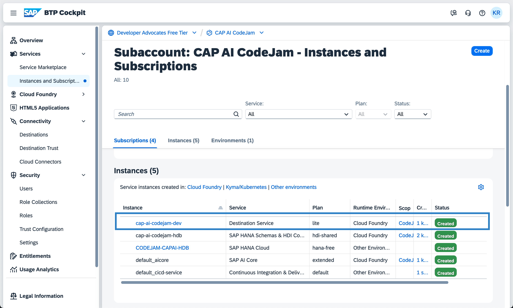
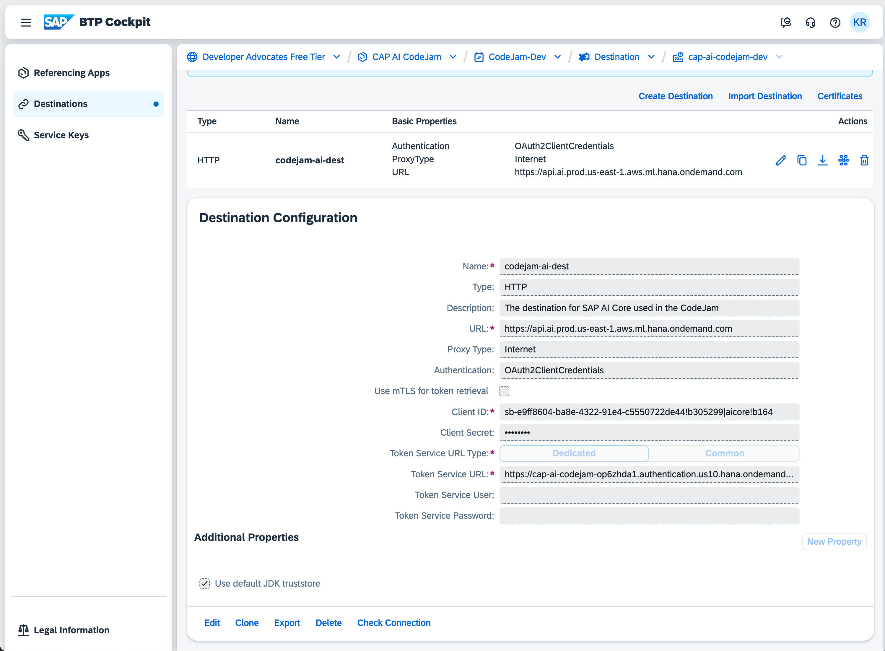
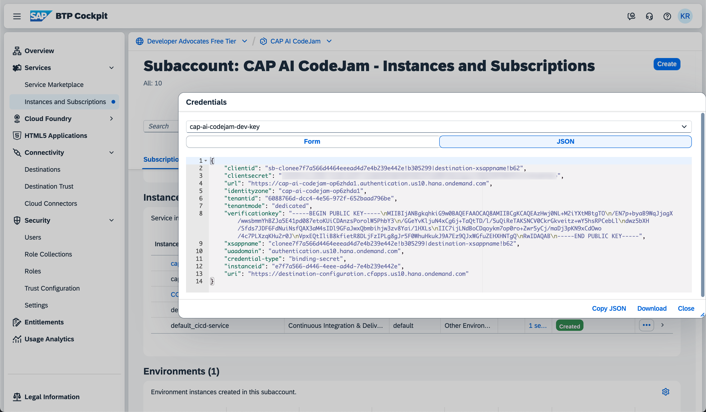
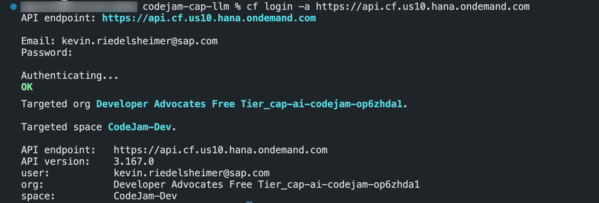
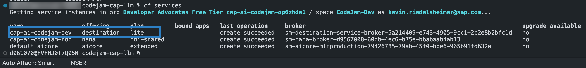
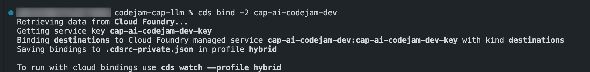
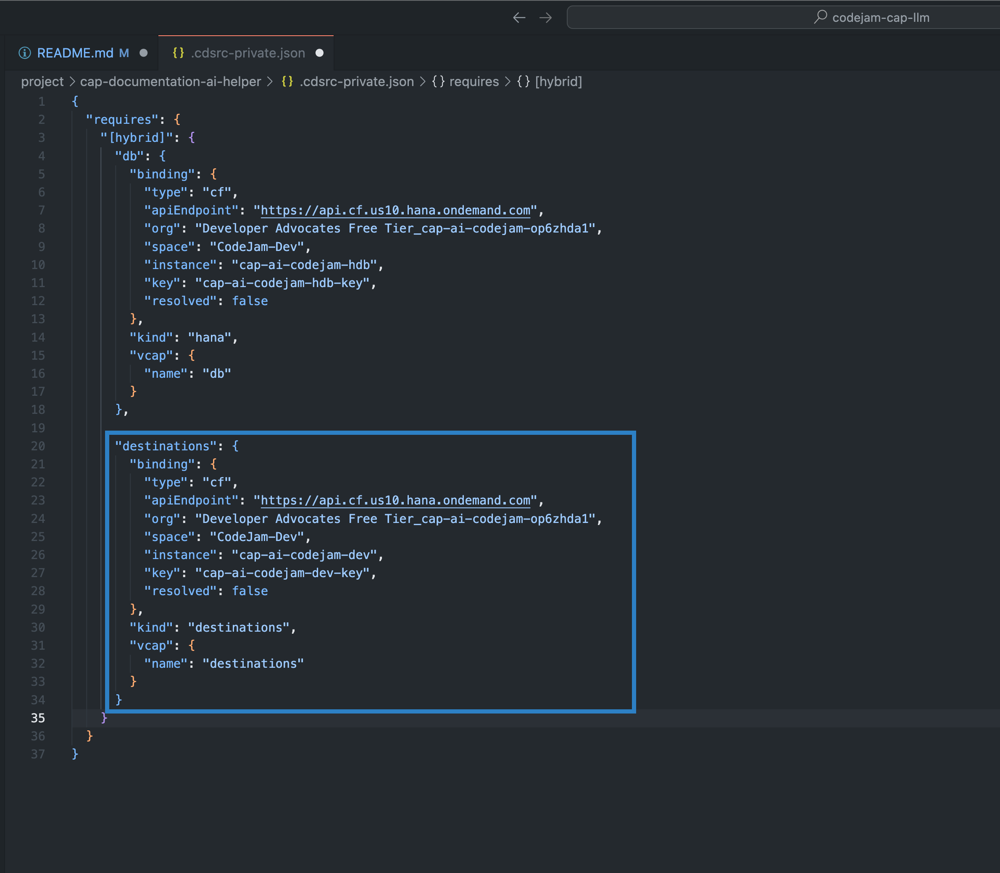
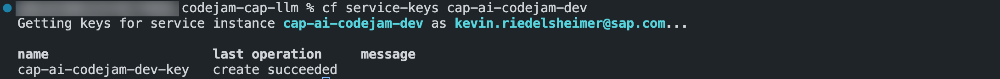

# Exercise 05 - Learn how to use the destination service on SAP BTP to provide connection details for SAP AI Core

SAP BTP can route requests to different services provided by BTP, your own applications and services, and even on-premise systems. For that, it can use the destination service. The destination service allows for configuration and creation of destinations pointing to an API endpoint. A destination is a configuration file written in JSON with information about the target API URL and it allows for configuring authentication parameters to authenticate requests against such endpoint. A destination is a convenient way of routing requests towards a system. The destination is secured by BTP that only allowed application instances can connect/ bind against a destination. Such binding happens through issuing a service key for that destination. As an example, if a developer wants to use a destination within a CAP application, a binding can be created between the application and the destination service on BTP via the `cds bind` command using the CDS CLI. In the following exercise you will learn how to configure such a destination on BTP and how to bind your CAP application against that destination.

A destination can be configured on different levels within BTP, but for this use case, destinations get created within the Destination Service for the provided subaccount.


The destination we're using for this CodeJam is already pre-configured because it is used by all attendees of this workshop. Nevertheless, the [SAP BTP set up guide](../../btp-setup-guide.md) provides instructions on how to entitle your BTP account to use the destination service and how to configure a new destination within the destination service.

## Understand how a destination for SAP AI Core is being configured

Your CAP application will use a destination on SAP BTP to connect to the SAP generative AI Hub instance. You will explore what information are being configured in the destination and how you bind your CAP application to that destination for the CAP-LLM-Plugin to send HTTP requests against SAP generative AI Hub.

Let's start by exploring the pre-configured destination on SAP BTP. A quick look at the destination configuration can be found below:

The destination for a typical SAP AI Core connection can be configured as following: 


| Property Name          | Value                   | Example                                                                |
| ---------------------- |:-----------------------:| ---------------------------------------------------------------------: |
| Name                   | <free to choose>        | ai_core_dest                                                           |
| Type                   | HTTP                    | -                                                                      |
| Description            | <free to choose>        | my SAP AI Core Destination                                             |
| URL                    | <AI_API_URL>            | https://api.ai.prod.us-east-1.aws.ml.hana.ondemand.com                 |
| Proxy Type             | Internet                | -                                                                      |
| Authentication         | OAuth2ClientCredentials | -                                                                      |
| Client ID              | <clientid>              | sb-e478287-ba9e-4223-98f5-c5579332rf55!b294456aicore@s345              |
| Client Secret          | <clientsecret>          | 49884e42q-45x6-154-54566545644564bvf56456465$46546TMKWn=               |
| Token Service URL Type | Dedicated               | -                                                                      |
| Token Service URL      | <url>                   | https://cap-ai-codejam-op5zdddw2.authentication.us10.hana.ondemand.com |

Feel free to explore the destination on SAP BTP yourself:

1. Go to the [CodeJam subaccount on SAP BTP](https://emea.cockpit.btp.cloud.sap/cockpit/#/globalaccount/275320f9-4c26-4622-8728-b6f5196075f5/subaccount/6088766d-dcc4-4e56-972f-652baad796be/)

2. Open the **Instances & Subscriptions** page through the sidebar navigation.

3. Under the section **Instances**, you can find the `cap-ai-codejam-dev` Destination Service instance. Click on the instance link.



4. The destination service should open in a separate tab in your browser. Over the sidebar navigation, open the **Destinations** view.

5. In the list of destinations, you should see only one destination `codejam-ai-dest`. Click on it.



As you can see, the configuration mirrors the information from the table above. PLEASE, do not change the destinations configuration or click on **Edit** because this will delete the authentication information from the destination and ruin the experience for the other attendees. In case you already clicked it, let us now so we can fix it 😉.

After setting up the destination, you can check the connection to see if you have done everything correctly. If a odd `404` appears within the `Connection successful` message, you can safely ignore that.

As you can see above, you need the `AI API URL` pointing to your SAP AI Core instance's endpoint. The authentication is defined as `OAuth2ClientCredentials` and the needed client ID, client secret and token service URL can be found in the service key for the SAP AI Core instance.



## Create a binding from your local CAP project to the destination

Your CAP application needs a binding to the configured destination to send requests through the destination to the SAP AI Core instance of the subaccount. The binding is a trust between your application, the destination service and respectively the configured destination. If you bind your application, a service key gets generated that gives your application the authorization to connect to the destination. You need to authorize against the BTP subaccount first using the Cloud Foundry CLI. If the authorization is successful you have access to the different service instances for the assigned subaccount. Having that, you can create bindings against these services using the CLI. If you create a binding, a service key is being issued granting your application or any other service to connect to the bound service instance. That will allow you to have a connection against the SAP AI Core destination that is described in the previous section. A result of that binding is the creation, or if already existent, the entry of a configuration of that binding in the `.cdsrc-private.json` file.

The `.cdsrc.json` or `.cdsrc-private.json` file is just one of many configuration files you can use within your CAP application. This particular file is for user-specific configurations that can be used across multiple projects. You could also add the binding configuration to a `.env` file if you want that configuration to be available only in the project environment. If you want to read more about the different configuration files, you can find a link to the documentation in the [Further Reading]() section of this exercise.

1. Open the project in SAP Business Application Studio (BAS) or VSCode.

2. Open a new terminal if not already open.

3. Log into the provided Cloud Foundry instance and authenticate using the provided credentials:

```bash
cf login -a https://api.cf.us10.hana.ondemand.com
```



Before you can bind the CAP application to the destination service, you need to retrieve the instance's name. You can do this via the SAP BTP UI or via the CLI.

4. In the terminal, enter the following command to list all services for that subaccount:

```bash
cf services
```



5. Copy the service name `cap-ai-codejam-dev`

Now that you have the service name you want to bind your application against you can use the cds cli to create the binding.

6. In the terminal, enter the following command to create the binding (replace the placeholder with a meaningful name):

```bash
cds bind -2 cap-ai-codejam-dev:<your-service-key-name>
```



You can open the `.cdsrc-private.json` file to see the binding configuration.



If you look at the configuration, you can see that there is a field for the service key. You can find that service key in the service instance on the SAP BTP UI too. Alternatively, you can use the `cf cli` to fetch the existing service keys for the destination service.

```bash
cf service-keys cap-ai-codejam-dev
```



> You might see multiple service keys being listed. That is because your fellow attendees created a service key for their application with this exercise.

With the service key, the binding created and the binding configuration in place, your application can now connect to the destination service of the CodeJam subaccount.

> You will create the needed connection configuration for the CAP-LLM-Plugin in exercise [09 Create the CAP-LLM-Plugin connection configuration](../09-create-connection-configuration/README.md). Please do not skip ahead.

## Further Reading

* [User-Specific Defaults in ~/.cdsrc.json](https://cap.cloud.sap/docs/node.js/cds-env#user-specific-defaults-in-cdsrc-json)
* [Service Bindings](https://cap.cloud.sap/docs/node.js/cds-connect#service-bindings)
* [Create and bind a Destination Service instance](https://help.sap.com/docs/connectivity/sap-btp-connectivity-cf/create-and-bind-destination-service-instance)
* [Set Up Tools to Connect With and Operate SAP AI Core - Tutorial](https://developers.sap.com/tutorials/ai-core-setup..html)

