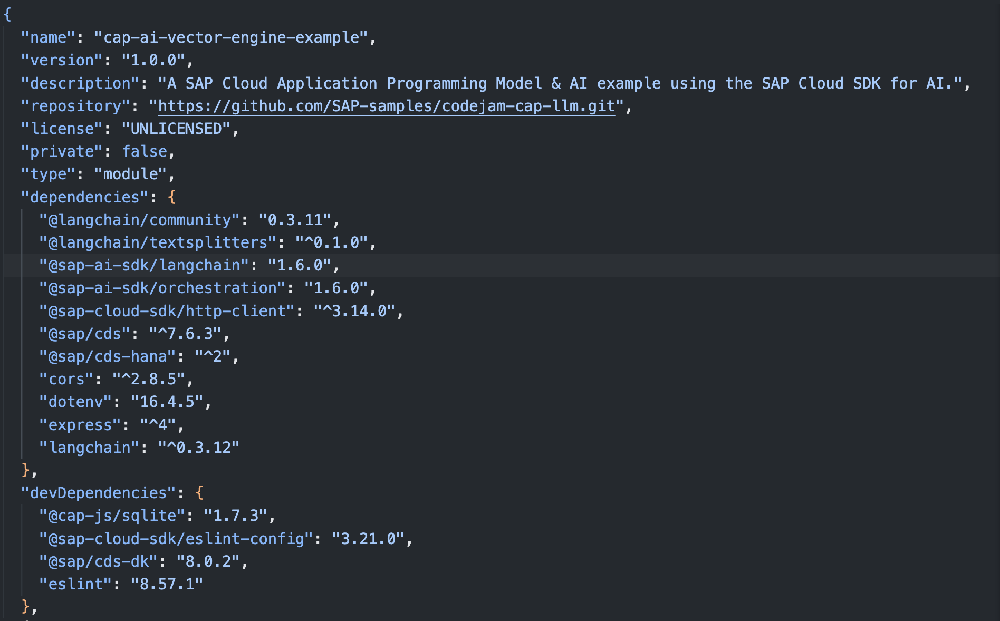
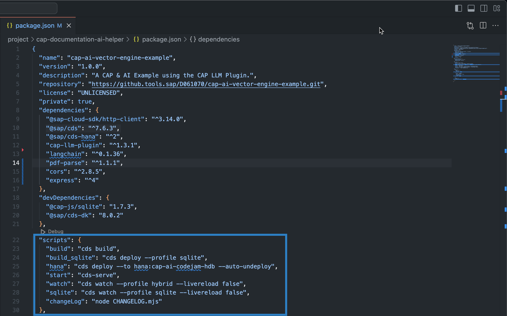
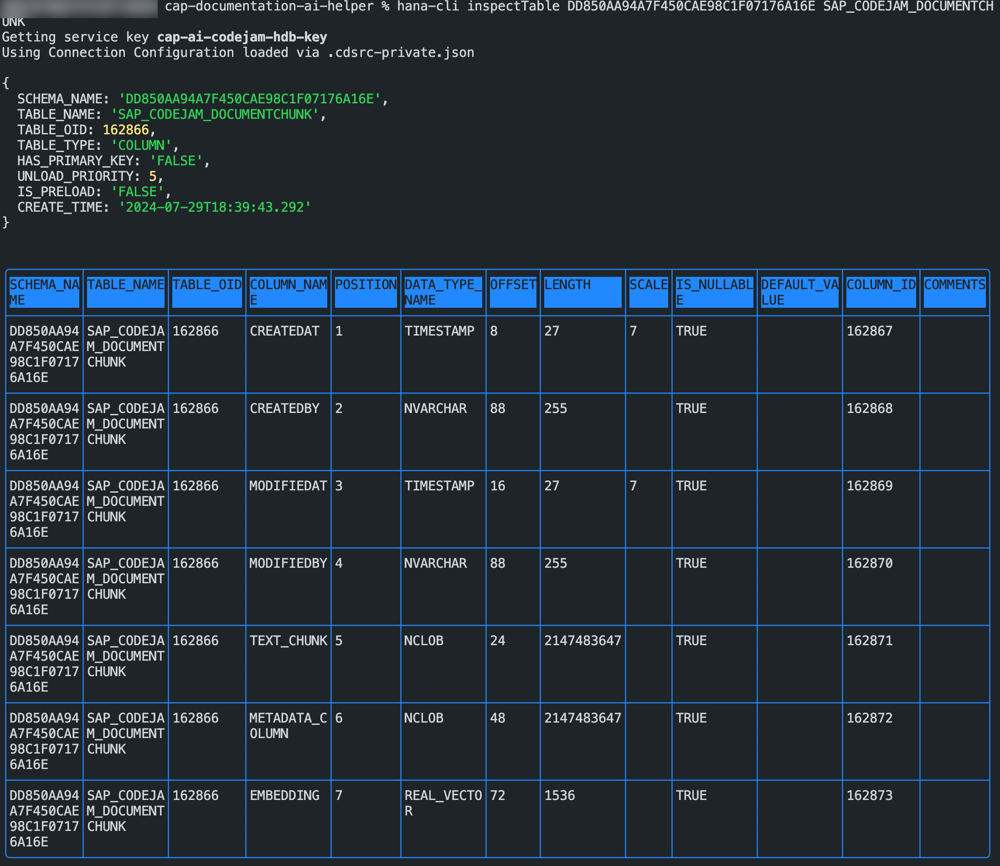

# Exercise 06 - Create the database schema for the CAP application

The repository you have cloned provides a skeleton project in the project folder. The skeleton project contains an already set up CAP application with the fully configured package.json and supporting files for the following exercices.

In this exercise you will:

* Explore the package.json and it's contents
* You will define the database schema for the HANA database, and you will
* Build and deploy the schema to your HDI container

## Explore the package.json file and it's contents

The `package.json` file includes all Node.js project specific configurations like project name, version, dependencies, and run scripts but also cds specific configurations like the HANA runtime information.

👉 Open the `package.json` file.

👉 Exermine the dependencies. Notice how there is a dependency for `langchain`, and the `CAP-LLM-Plugin`.



👉 Exermine the listed scripts.



* `build`       : Runs a the `cds build` command to build the CAP project.
* `build_sqlite`: Builds the CAP application for usage on a SQLite database.
* `hana`        : Deploys the database artifacts to your HDI container and undeploys any delta to your current configuration in case artifacts are already deployed. Make sure to replace the instance name with your specific HDI instance.
* `start`       : Starts the CAP application.
* `watch`       : Deploys your changes specific to your service to localhost using the hybrid profile establishing a connection to your real HDI container instance.
* `sqlite`      : Deploys your changes specific to your service to localhost using the hybrid profile establishing a connection to a real SQLite database.

You can add as many scripts as you want here making it easier to run commands for your project.

## Define the database schema

Within a CAP application you can define a database schema that can be build into HANA database artifacts. The artifacts can be deployed to a bound HDI container which will cause the creation of the database tables, relationships, views and any other HANA database artifacts.

For this project the schema has exactly one entity; `DocumentChunk`.

The `DocumentChunk` entity contains the text chunks and embeddings for the CAP documentation PDF. In the next exercise [07 - Define the Embedding Service](../07-define-embedding-service/README.md), you will define a service for the chunking of a PDF document and retrieving vector embeddings for the individual chunks. The chunks and vector embeddings will be saved in the `DocumentChunk` entity.

👉 Create a new file under the `db` folder and name it `schema.cds`.

👉 In the file define a namespace `namespace sap.codejam`:

```cds
namespace sap.codejam;
```

The namespace allows for a better identification and provides uniqueness to the entities within that namespace. It also will cause the database table to be named `SAP_CODEJAM_<Entity Name>` in example `SAP_CODEJAM_DOCUMENTCHUNK`.

👉 Right below, add the following line of code:

```cds
using {  managed } from '@sap/cds/common';
```

The entity should be managed, meaning it will get an autogenerated UUID, time stamps for creation and mutation.

👉 Lastly, add the definition for the `DocumentChunk` entity. The entity is using the `managed` feature from the `cds.common` package.

```cds
entity DocumentChunk: managed {
    text_chunk          : LargeString;
    metadata_column     : LargeString;
    embedding           : Vector(1536);
}
```

The entity defines three fields:

* `text_chunk`      : Stores the individual created text chunks.
* `metadata_column` : Stores the path to information document. The document is a PDF including business contextual information for creation of the vector embeddings.
* `embedding`       : Stores the encoded vector embeddings.

👉 Safe the file.

## Build and deploy the schema to your HDI container

Because you created a binding to our HDI container in exercise 02 you have all configurations in place to deploy HANA database artifacts to the instance. To do so you need to build the artifacts first, for that you can use the `hana` script from the `package.json` or manually enter the `cds deploy` command.

👉 Open a terminal or use an existing one.

👉 Make sure that you are still connected to the Cloud Foundry instance by checking the connection details:

```bash
cf target
```


If the reply from the CLI tells you to log in again simply enter `cf login`. This time you don't have to specify the API endpoint because it is stored from the previous login.

```bash
cf login
```

👉 If you want to manually build and deploy the artifacts, call the `cds deploy --to hana:<hdi-instance>` command:

```bash
cds deploy --to hana:cap-ai-codejam-hdb --auto-undeploy
```

The `--auto-undeploy` argument cause the database to adjust to the new runtime definition of your database artifacts.

You can also use the provided script:

```bash
npm run hana
```

You will see a big terminal output listing the different steps of the building and deployment process.


Great! The database is initialized and the table with all necessary fields created.

## Examine the database table

There are multiple ways of viewing your database artifacts on SAP HANA Cloud. One would be to use the **SAP HANA Database Explorer** and of course via the CLI if you don't want to use the UI. You will find a tutorial in the [Further Reading]() section, if you are interested in how to use the **SAP HANA Database Explorer**. You should use the CLI today, because it is quicker. `#TheFutureIsTerminal`

The BAS instance as well as the container image you run locally have the [hana-cli](https://github.com/SAP-samples/hana-developer-cli-tool-example) installed.

👉 Open a new terminal or use an existing one.

👉 Enter the `hana-cli help` command to get a list of all available commands:

```bash
hana-cli help
```

👉 To get a list of all available tables within your HDI container you can execute the following command:

```bash
hana-cli tables
```


From the response you can extract the schema name and the table name. You will use the information to fetch all information about that table.

👉 Enter the following command to list the table information:

```bash
hana-cli inspectTable DD850AA94A7F450CAE98C1F07176A16E SAP_CODEJAM_DOCUMENTCHUNK
```



You can see all created fields as defined in the [schema.cds](../../project/cap-documentation-ai-helper/db/schema.cds). Notice that it also has all the fields from the `managed` feature from the `cds.common` package.

## Summary

At this point ...

## Further reading

* [hana-cli commands](https://github.com/SAP-samples/hana-developer-cli-tool-example?tab=readme-ov-file#commands)
* [Deploying to SAP HANA](https://cap.cloud.sap/docs/guides/databases-hana#deploying-to-sap-hana)
* [Deploy to SAP HANA - Tutorial](https://developers.sap.com/tutorials/hana-cloud-deploying..html)

---

## Questions

If you finish earlier than your fellow participants, you might like to ponder these questions. There isn't always a single correct answer and there are no prizes - they're just to give you something else to think about.

---

[Next exercise](../07-define-embedding-service/README.md)