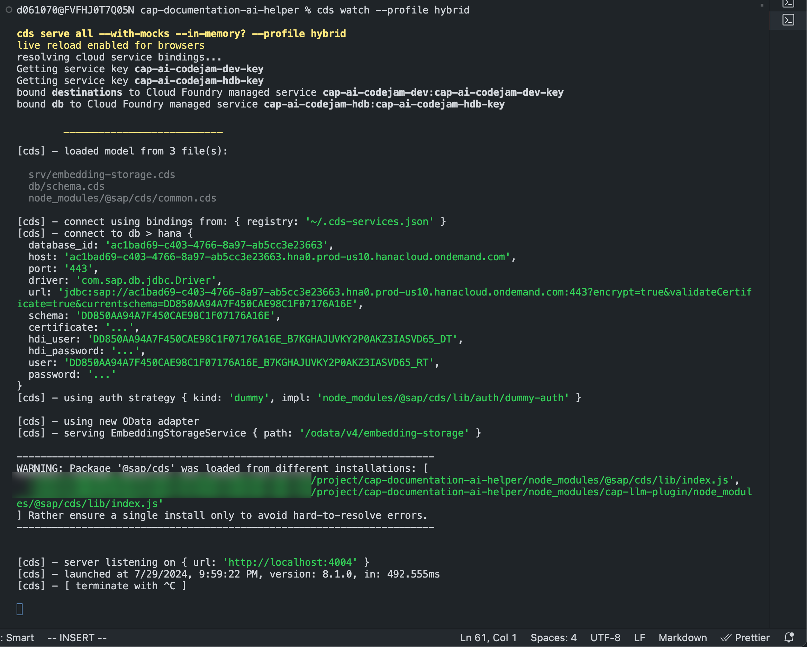
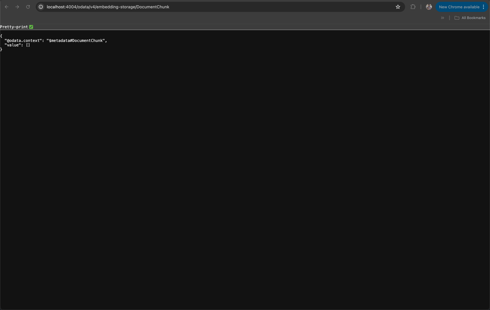

# Exercise 07 - Define the embeddings service

With the database being in place, you can define the service that is responsible for chunking the context information, creating the vector embeddings, encoding them and storing it into the database.

In this exercise you will learn:

* How to use CDS to define an OData service in CAP.

## Create the embeddings service CDS definition

You can create an OData service using CDS to expose entities, provide functions, secure APIs and much more. You will find detailed reading material in the [Further Reading]() section.

👉 Create a new file in the `srv` folder and name it `embedding-storage.cds`.

👉 In that file add a reference to the database schema:

```cds
using { sap.codejam as db } from '../db/schema';
```

This allows you to access entity definitions from the database schema.

👉 Define the service using the `service` keyword:

```cds
service EmbeddingStorageService { }
```

👉 Within the curly brackets add a projection on the `DocumentChunk` entity to expose it via OData. Add the following lines of code:

```cds
entity DocumentChunk as projection on db.DocumentChunk
                            excluding { embedding };
```

Using the `excluding` keyword, the embedding field is being excluded from the response.

👉 Define two functions for storing and deleting vector embeddings.

```cds
    function storeEmbeddings() returns String;
    function deleteEmbeddings() returns String;
```

The `storeEmbeddings()` function will utilize third party npm packages to load the PDF, extract the information and chunk it. The CAP-LLM-Plugin creates and sends a request to the embeddings model through SAP generative AI Hub using the previously defined destination and finally stores the result in the database using CDS queries.

You will implement that in the next exercise. You're getting closer to see the first fruits of our hard work 😊🧑‍💻.

👉 Save the file.

## Inspect your service

You can run `cds watch --profile hybrid` or `npm run hana` to run the service locally and establish a connection to SAP HANA Cloud.

👉 Open a new terminal or use an existing one

👉 Execute the `cds watch` command:

```bash
cds watch --profile hybrid
```



You can see that your CAP service is creating and establishing a connection to your HDI container and database. The CAP service gets spun up and is now available under the path `/odata/v4/embedding-storage`.

👉 Inspect your service by opening `http://localhost:4004` in your web browser.


You will get a UI out of the box. It allows you to inspect your OData service, get the API documentation and call the different endpoints.

Try the endpoint for fetching the `DocumentChunks` from the database table.

👉 Click on `DocumentChunk`.



If you take a look in your terminal, you can see that it is calling a `GET` OData request. The database tables are empty at this point, in the next exercise you will change that by implementing the `storeEmbeddings()` function.

You probably noticed that the defined functions are not visible in the UI. But no worries, you will learn how to call them from the web browser directly in a later exercise.

## Summary

At this point you have learned what the embedding service is and how to define functions using CDS. You have also learned how to use `cds watch --profile hybrid` can be used to test the CAP application with a real connection to SAP HANA Cloud.

## Further Reading

* [CAP Service Integration CodeJam](https://github.com/SAP-samples/cap-service-integration-codejam)
* [Back to Basics with SAP Cloud Application Programming Model(CAP) - YouTube](https://youtube.com/playlist?list=PL6RpkC85SLQABOpzhd7WI-hMpy99PxUo0&si=V9Rqcbg84UGLQOi-)
* [Providing Services - CAP Documentation](https://cap.cloud.sap/docs/guides/providing-services#providing-services)

---

[Next exercise](../08-implement-embedding-service/README.md)