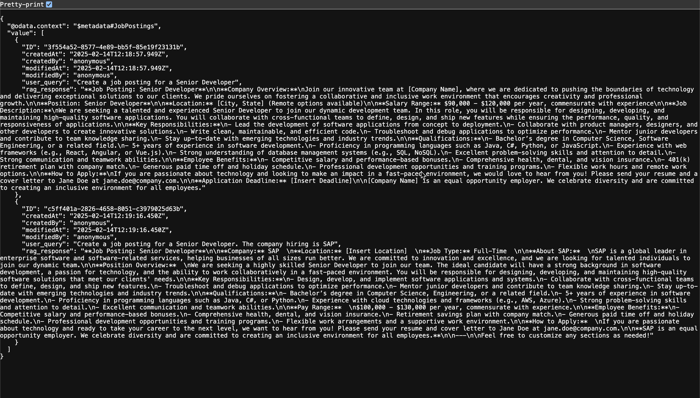

# Exercise 07 - Implement the Job Posting Service

_Estimated Time: **45 - 60 min**_

In the last exercise, you created a deployment for orchestration, allowing you to create an orchestration workflow. This workflow can be created with the SAP Cloud SDK for AI including templating, data masking, document grounding and content filtering. Grounding describes the process of retrieval-augmented generation (RAG). Grounding allows you to create vector embeddings for a given contextual document or information source, and also get the correct embedding for a given user query making it easy to communicate with the chat model without having to do all of that manually.

In this exercise, you will learn the following:

- How to use the SAP Cloud SDK for AI orchestration API.

## Table of Contents

- [Implement the OData function handler code stubs](#implement-the-odata-function-handler-code-stubs)
- [Implement input parameter validation](#implement-input-parameter-validation)
- [Implement the job posting creation](#implement-the-job-posting-creation)
  - [Implement the AI orchestration in the AIHelper](#implement-the-ai-orchestration-in-the-aihelper)
  - [Implement insertion and deletion of Job Postings](#implement-insertion-and-deletion-of-job-postings)
- [Try out your new API](#try-out-your-new-api)
- [Check the database table for job postings](#check-the-database-table-for-job-postings)
- [Experiment with the orchestration service filters](#experiment-with-the-orchestration-service-filters)
- [Summary](#summary)
  - [Questions for Discussion](#questions-for-discussion)
- [Further Reading](#further-reading)

## Implement the OData function handler code stubs

In [Exercise 05](../05-create-vector-embeddings/README.md), you implemented the code for creating and deleting vector embeddings out of a contextual document. You are now about to use the orchestration service to access these vector embeddings and execute a Retrival-Augmented generation workflow.

👉 Open the [job-posting-service.js](../../project/job-posting-service/srv/job-posting-service.js) file.

👉 In the function export, right below the `createVectorEmbeddings`, add the following function handlers:

```JavaScript
this.on('createJobPosting', async req => {
    // implementation goes here ...
});

this.on('deleteJobPosting', 'JobPosting', async (req) => {
  const ID = req.params[0].ID;

  const result = await DBUtils.deleteJobPosting(ID);

  return {
    success: true,
    message: result
  };
});

this.on('deleteAll', 'JobPosting', async (req) => {
  const result = await DBUtils.deleteJobPostings();

  return {
    success: true,
    message: result
  };
});
```

Your function export block should look like this now:

```JavaScript
this.on('createVectorEmbeddings', async () => {
  const embeddings = await AIHelper.createVectorEmbeddings();
  const embeddingEntries = await DBUtils.createEmbeddingEntries(embeddings);
  await DBUtils.insertVectorEmbeddings(embeddingEntries);

  return {
    count: embeddingEntries.length,
    chunks: embeddingEntries.length,
    message: 'Vector embeddings created and stored in database'
  };
});

this.on('createJobPosting', async (req) => {
  // implementation goes here ...
});

this.on('deleteJobPosting', 'JobPosting', async (req) => {

  const ID = req.params[0].ID;

  const result = await DBUtils.deleteJobPosting(ID);

  return {
    success: true,
    message: result
  };
});

this.on('deleteAll', 'JobPosting', async (req) => {

  const result = await DBUtils.deleteJobPostings();

  return {
    success: true,
    message: result
  };
});

this.on('deleteAll', 'DocumentChunk', async (req) => {
  const result = await DBUtils.deleteVectorEmbeddings();

  return {
    success: true,
    message: result
  };
});
```

## Implement input parameter validation

For both, the creation of a job posting and the deletion of a specific job posting, the API requires input parameters for the user query or the job id. These values need to be checked if they are `undefined` or `empty` to prevent runtime errors. You will implement a simple method checking these values and, in case of an unwanted value, throw an error.

👉 Below the closing curly bracket of the function export add the following method declaration:

```JavaScript
const wrongInputError = 'Required input parameters not supplied';

function validateInputParameter(parameter) {
    // implementation goes here
}
```

Now, you will implement a check for `undefined` and a check for an empty String.

👉 In the method add the following lines of code:

```JavaScript
if (typeof parameter === 'undefined') {
    throw new Error(wrongInputError);
}

function isEmpty(input) {
    return input.trim() === '';
}

if (isEmpty(parameter)) {
    throw new Error(wrongInputError);
}
```

Your method should look like this now:

```JavaScript
function validateInputParameter(parameter) {
  if (typeof parameter === 'undefined') {
    throw new Error(wrongInputError);
  }

  function isEmpty(input) {
    return input.trim() === '';
  }

  if (isEmpty(parameter)) {
    throw new Error(wrongInputError);
  }
}
```

## Implement the job posting creation

With the input validation in place, you can go ahead and implement the RAG flow. Before you do that, think about what should happen.

1. A user inputs a query describing what kind of job posting should be created.
2. Your OData service takes the input and passes it through to the OData function handler for the RAG execution.
3. The user query needs to be sent to an embedding client to get a vector for that user query. This is required to execute the similarity search on the already embedded vector embeddings in the SAP HANA Cloud Vector Engine. You will use the cosine similarity algorithm.
4. A chat client establishes a connection to a specific chat model; for this Codejam, you will use the `gpt-4o-mini`.
5. The vector of the user query together with the textual user query, is sent to the chat model using a template giving extra context.
6. The chat model processes the request and returns a response to your client.
7. The response gets passed to the `DBUtils` to create a new database entry.
8. The entry is inserted into the database using CQL.

While this may sound complex, don't worry - it's not that bad. Let's go through it step-by-step.

👉 Within the `createJobPosting` function handler retrieve the user query from the request and pass it to the input validation method you've implemented before:

```JavaScript
const user_query = req.data.user_query;
validateInputParameter(user_query);
```

👉 Right below the input validation within the `createJobPosting` method, call the following code:

```JavaScript
const [userQuery, ragResponse] = await AIHelper.orchestrateJobPostingCreation(user_query);
let entry = DBUtils.createJobPosting([userQuery, ragResponse]);
```

This code calls the orchestration client for chat completion using the passed-in user query (Steps 2 - 6). The result is passed to `DBUtils` to create a new database entry (Step 7).

The last step is to insert the database entry into the database (Step 8).

👉 Insert the following code as the last line to the `createJobPosting` method:

```JavaScript
await DBUtils.insertJobPosting(entry);
return entry;
```

Your method should now look like this:

```JavaScript
this.on('createJobPosting', async (req) => {
  const user_query = req.data.user_query;
  validateInputParameter(user_query);

  const [userQuery, ragResponse] = await AIHelper.orchestrateJobPostingCreation(user_query);
  const entry = DBUtils.createJobPosting([userQuery, ragResponse]);
  await DBUtils.insertJobPosting(entry);

  return entry;
});
```

### Implement the AI orchestration in the AIHelper

👉 Open the [ai-helper.js](../../project/job-posting-service/srv/helper/ai-helper.js) file.

Within the file you need to import the orchestration client and the content filter from the `@sap-ai-sdk/orchestration` package.

👉 Add the following lines of code to the top of the file:

```JavaScript
import {
  OrchestrationClient,
  buildAzureContentSafetyFilter
  } from '@sap-ai-sdk/orchestration'
```

👉 To use CDS methods import CDS by adding the following line of code directly below the import statement:

```JavaScript
import cds from '@sap/cds';
```

👉 To have access to the Document Splits table, add a `DocumentChunk` constant. You will need this entity later in the RAG flow:

```JavaScript
const { DocumentChunk } = cds.entities;
```

👉 Right below the `DocumentChunk` statement add the following constants containing the chat and embedding model's name:

```JavaScript
const chatModelName = 'gpt-5-mini';
```

You define the chat model's name as a constant because you'll use it later. This gives you a single point of truth in case you want to change the chat model in the future.

👉 Below the `createVectorEmbeddings` function handler, add the `orchestrateJobPostingCreation` function you have called in the `job-posting-service.js`:

```JavaScript
async function orchestrateJobPostingCreation(user_query) {
  try {
      // implementation goes here
    } catch (error) {
    console.log(
      `Error while generating Job Posting.
      Error: ${error.response}`
    );
    throw error;
  }
}
```

Within the `try` block, you will add the complete logic for the RAG flow. You will start by implementing the creation of the vector embedding for the given user query. This is necessary for the similarity search using the cosine similarity algorithm.

👉 Initialize an embedding client for the `text-embedding-3-small` model:

```JavaScript
const embeddingClient = new AzureOpenAiEmbeddingClient({
    modelName: embeddingModelName,
    maxRetries: 0,
    resourceGroup: resourceGroup
});
```

Embedding the user query will allow for the creation of a vector embedding. The vector embedding can then be used to calculate the closest distance to existing contextual embeddings in the SAP HANA Cloud vector engine. The result of this is that you will receive the contextual vector embedding with the highest relevance to the user query. This embedding can then be sent to the chat model as contextual information to answer the user query.

👉 Embed the user query with the embedding client:

```JavaScript
let embedding = await embeddingClient.embedQuery(user_query);
```

👉 Execute the cosine similarity using a `SELECT` statement and ordering the result using the cosine similarity for the given vector of the user query:

```JavaScript
let similarity_chunks = await SELECT.from(DocumentChunk)
      .orderBy`cosine_similarity(embedding, to_real_vector(${JSON.stringify(embedding)})) DESC`;
```

The `cosine_similarity` call in the SQL statement is not the default SQL. This is an added function by the HANA Cloud Vector Engine.

👉 Extract the first three results from the list `similarity_chunks`:

```JavaScript
let context = similarity_chunks.slice(0, 3).map((split) => split.text_chunk)
```

You have all relevant information at hand to construct the template which is getting send to the chat model via the orchestration client.

👉 Now, create a new orchestration client, passing in the required LLM, template, and filter:

```JavaScript
const filter = buildAzureContentSafetyFilter({
      Hate: 'ALLOW_SAFE',
      Violence: 'ALLOW_SAFE',
      SelfHarm: 'ALLOW_SAFE',
      Sexual: 'ALLOW_SAFE',
    })

const orchestrationClient = new OrchestrationClient(
      {
        promptTemplating: {
          model: {
            name: chatModelName,
            params: {
              max_tokens: 500,
              temperature: 0.1
            }
          },
          prompt: {
            template: [
              {
                role: 'system',
                content: `You are an assistant for HR recruiter and manager.
              You are receiving a user query to create a job posting for new hires.
              Consider the given context when creating the job posting to include company relevant information like pay range and employee benefits.
              Consider all the input before responding especially Recruiter information, Application deadline, Company Name, Location, Salary, Hiring Bonus and other benefits.`,
              },
              {
                role: 'user',
                content: `Question: {{?question}}, context information: ${context}`,
              },
            ],
          },
        },
        filtering: {
          input: {
            filters: [filter],
          },
          output: {
            filters: [filter],
          },
        },
        // Masking goes here...
      },
      { resourceGroup: resourceGroup }
  );
```

A message to a chat model requires a couple of information. First of all, you need to specify if you are sending an user message or a system message. In your case, you are constructing a system message with the general instructions for the LLM. You add the result of the cosine similarity search to the instructions for the model to give a better response. To the user, this additional information is hidden so they can focus on their request. The user query itself is being sent with the user profile to the LLM.

The client is defined to connect to the `GPT-5-Mini` using a template describing what you want the chat model to do including the user query. Finally you define strict rules for the content filter. The service is not tolerating any inappropriate or discriminating language which is of utmost importance! Take a look at the official documentation to understand content filters and learn more about levels of severity: [Azure AI Content Filtering](https://learn.microsoft.com/en-us/azure/ai-services/openai/concepts/content-filter?tabs=warning%2Cuser-prompt%2Cpython-new).

The levels available are:

- ALLOW_ALL
- ALLOW_SAFE
- ALLOW_SAFE_LOW
- ALLOW_SAFE_LOW_Medium

This helps you to prevent hateful speech, violent speech and other inappropriate input but also output from the model. This allows you to granularly define how content should be filtered and to what degree such language should be allowed.

If the user query successfully runs through the content filter, the response will be **200**, in case the content filter catches a user query you should receive a **400**. When you are testing your service, you can change the filter values to see how it applies to different user query inputs.

```bash
HTTP Response: Request failed with status code 400
{
  "request_id": "8a707a92-7122-4c50-bc33-9f305e9028e6",
  "code": 400,
  "message": "Content filtered due to safety violations. Please modify the prompt and try again.",
  "location": "Filtering Module - Input Filter",
}
```

👉 Below the initialization of the orchestration client call the client's chat completion method:

```JavaScript
const response = await orchestrationClient.chatCompletion({
  placeholderValues: { question: user_query }
});
console.log(
  `Successfully executed chat completion. ${response.getContent()}`
);
```

👉 Finally, return the user query, and the chat model response.

```JavaScript
return [user_query, response.getContent()];
```

👉 Lastly, add the `orchestrateJobPostingCreation` to the function export:

```JavaScript
export { createVectorEmbeddings, orchestrateJobPostingCreation };
```

The complete implementation should look like this now:

```JavaScript
async function orchestrateJobPostingCreation(user_query) {
  console.log(user_query);
  try {
    const embeddingClient = new AzureOpenAiEmbeddingClient({
      modelName: embeddingModelName,
      maxRetries: 0,
      resourceGroup: resourceGroup,
    });

    let embedding = await embeddingClient.embedQuery(user_query);
    let similarity_chunks = await SELECT.from(DocumentChunk).orderBy`cosine_similarity(embedding, to_real_vector(${JSON.stringify(
      embedding
    )})) DESC`;

    let context = similarity_chunks.slice(0, 3).map((split) => split.text_chunk);

    const filter = buildAzureContentSafetyFilter({
      Hate: 'ALLOW_SAFE',
      Violence: 'ALLOW_SAFE',
      SelfHarm: 'ALLOW_SAFE',
      Sexual: 'ALLOW_SAFE',
    });

    const orchestrationClient = new OrchestrationClient(
      {
        promptTemplating: {
          model: {
            name: chatModelName,
            params: {
              max_tokens: 500,
              temperature: 0.1
            }
          },
          prompt: {
            template: [
              {
                role: 'system',
                content: `You are an assistant for HR recruiter and manager.
              You are receiving a user query to create a job posting for new hires.
              Consider the given context when creating the job posting to include company relevant information like pay range and employee benefits.
              Consider all the input before responding especially Recruiter information, Application deadline, Company Name, Location, Salary, Hiring Bonus and other benefits.`,
              },
              {
                role: 'user',
                content: `Question: {{?question}}, context information: ${context}`,
              },
            ],
          },
        },
        filtering: {
          input: {
            filters: [filter],
          },
          output: {
            filters: [filter],
          },
        },
        // Masking goes here ...
      },
      { resourceGroup: resourceGroup }
    );
    console.log(orchestrationClient);
    const response = await orchestrationClient.chatCompletion({
      placeholderValues: { question: user_query }
    });
    console.log(response);
    console.log(`Successfully executed chat completion. ${response.getContent()}`);
    return [user_query, response.getContent()];
  } catch (error) {
    console.log(
      `Error while generating Job Posting.
      Error: ${error.response}`
    );
    throw error;
  }
}
```

I would encourage you to at least test the API endpoint once.

```text
/odata/v4/job-posting/createJobPosting(user_query='Create a job posting for a Senior Developer for the company AwesomeTech Inc')
```

The full URL should look something like this (depending on if you run it via BAS or locally):

```text
-- BAS

https://port4004-workspaces-ws-l2nzh.eu10.applicationstudio.cloud.sap/odata/v4/job-posting/createJobPosting(user_query='Create%20a%20job%20posting%20for%20a%20Senior%20Developer%20for%20the%20company%20AwesomeTech%20inc')

-- Locally

http://localhost:4004/odata/v4/job-posting/createJobPosting(user_query='Create%20a%20job%20posting%20for%20a%20Senior%20Developer%20for%20the%20company%20AwesomeTech%20inc')
```

Instead of testing it through the browser, it is easier to use the `test-api.http` file. Within that file the possible calls are maintained and you can test them directly from within the file.

## Check the database table for job postings

Use the learned technics to inspect the entries in the Job Postings table.

If you run the `cds watch` command, or if you still have the `localhost` open, you can click on the `Job Postings` entity to load all entries from the database and display them in a JSON format.

You can also use the URL directly:

```bash
/odata/v4/job-posting/JobPostings
```



Feel free to experiment with different queries to see what happens. As you can see in the screenshot, the second posting as `SAP` as the company name filled in. This is because the company name was provided in the query.

## Experiment with the orchestration service filters

You spend a lot of time implementing the code to get the orchestration service up and running. You have understood how the API works and how you can integrate it into a CAP application service.

At this point, I would encourage you to go back to the service implementation and play around with the different content filter options on the orchestration service. See how the filter level changes make the chat model respond differently. This will give you a better understanding on how you can utilize content filters to make sure that your AI services behave ethically.

For example, you can send a user query asking the model to create a Job Posting which should include words like `stupid`. The filter should block the request.

It makes sense to look at the documentation for content filtering with the `langchain` package [Chat Completion - Azure Content Filter](https://sap.github.io/ai-sdk/docs/js/orchestration/chat-completion#azure-content-filter)

## Summary

In this exercise, you implemented the job posting service and its OData function handlers. You have utilized the SAP Cloud SDK for AI to connect to SAP AI Core via the orchestration service. You have connected to the orchestration deployment to ask a chat model to create a job posting for you using the previously created vector embeddings.

### Questions for Discussion

1. What is the main purpose of the `orchestrateJobPostingCreation` function in the implementation?

<details><summary>Answer</summary>
The `orchestrateJobPostingCreation` function handles the RAG flow for creating job postings. It takes a user query, creates a vector embedding for it using the `text-embedding-3-small` model, retrieves the most relevant context from the database using cosine similarity, and sends the user query along with the contextual information to a chat model (`gpt-4o-mini`). The response from the chat model is then returned and stored in the database as a new job posting.
</details>

## Further Reading

- [@sap-ai-sdk/orchestration - Documentation](https://github.com/SAP/ai-sdk-js/blob/main/packages/orchestration/README.md)
- [Chat Completion - Azure Content Filter](https://sap.github.io/ai-sdk/docs/js/orchestration/chat-completion#azure-content-filter)

---

[Next exercise](../08-data-masking-and-anonymization/README.md)
