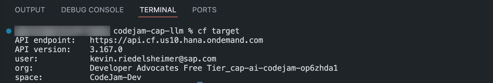

# Exercise 08 - Implement the Job Posting Service

The implementation for creating and deleting job postings handles a lot of different tasks like creating an orchestration client, connecting to SAP AI Core, talking to a chat model, inserting or deleting entries to the HANA database. All of that code should be implemented clean and easy to read. To achieve a more clean code structure, you will implement most of the business logic in separate files achieving separation of concerns. The separation will be treated lightly so you will only create two separate files, one for handling all AI relevant tasks, and one for handling all database related tasks. The project provides you with the two files that are currently empty: `AIHelper` and `DBUtils`.

You will implement the function handlers, and you will call logic from within the `AIHelper` and the `DBUtils`. You will jump back and forth between these files to implement the needed business logic.

In this exercise, you will learn the following:

- How to implement OData function handlers.
- How to use the SAP Cloud SDK for AI orchestration API.
- How to insert entries into the HANA database.
- How to delete entries from a table within the HANA database.

## Implement the OData function handler code stubs

The SDK uses ES6 for module loading which means that you need to export the function implementations differently compared to what you are used to using CAP. For this Codejam, you can simply use the `export default function()` approach.

👉 Open the `job-posting-service.js` file.

👉 Add the following code block to the file:

```JavaScript
export default function () {
// implementation goes here ...
}
```

👉 In the code block add the following function handlers:

```JavaScript
this.on('createJobPosting', async req => {
    // implementation goes here ...
 });

this.on('deleteJobPosting', async req => {
    // implementation goes here ...
 });

this.on('deleteJobPostings', async () => {
    // implementation goes here ...
 });
```

These three function handlers are handling the OData function definitions from the [job-posting-service.cds](../../project/job-posting-service/srv/job-posting-service.cds). You might notice that `createJobPosting` and `deleteJobPosting` get passed in a request parameter. This is necessary to retrieve the user query in the case for creating a job posting and an ID in case of deleting a job posting.

## Implement input parameter validation

For both, the creation of a job posting and the deletion of a specific job posting, the API requires input parameters for the user query or the job id. These values need to be checked if they are `undefined` or `empty` to prevent runtime errors. You will implement a simple method checking these values and in case of an unwanted value throw an error.

👉 Below the closing curly bracket of the function export add the following method declaration:

```JavaScript
function validateInputParameter(parameter) {
    // implementation goes here
}
```

Now, you will implement a check for `undefined` and a check for an empty String.

👉 In the method add the following lines of code:

```JavaScript
if (typeof parameter === 'undefined') {
    throw new Error(wrongInputError);
}

function isEmpty(input) {
    return input.trim() === '';
}

if (isEmpty(parameter)) {
    throw new Error(wrongInputError);
}
```

Your method should look like this now:

```JavaScript
function validateInputParameter(parameter) {
  if (typeof parameter === 'undefined') {
    throw new Error(wrongInputError);
  }

  function isEmpty(input) {
    return input.trim() === '';
  }

  if (isEmpty(parameter)) {
    throw new Error(wrongInputError);
  }
}
```

## Implement the job posting creation

With the input validation in place, you can go ahead and implement the creation of a job posting. Before you do that, think about what should happen.

1. A user inputs a query describing what kind of job posting should be created.
2. Your OData service takes the input and passes it through to the orchestration client.
3. The orchestration client establishes connection to a specific chat model, for this Codejam you will use the `gpt-4o-mini`.
4. Together with the query, the orchestration client pushes a template giving extra context, to the chat model.
5. To make sure, there is nothing inappropriate passed to the chat model a input filter is being applied.
6. The chat model processes the request and returns a response to your client.
7. The response gets passed to the `DBUtils` to create a new database entry.
8. The entry then gets inserted into the database with the help of CQL.

To be fair, this seems like a lot but no worries it is actually not that bad. Let's go through it step-by-step.

👉 Within the `createJobPosting` function handler retrieve the user query from the request and pass it to the input validation method you've implemented before:

```JavaScript
const user_query = req.data.user_query;
validateInputParameter(user_query);
```

You will call methods you haven't implemented yet, but no worries this will happen in the next step (Step 1).

👉 Right below the input validation within the `createJobPosting` method, call the following code:

```JavaScript
let entry = await DBUtils.createJobPosting(
    await AIHelper.orchestrateJobPostingCreation(user_query)
);
```

This code is calling the orchestration client for chat completion using the passed in user query (Steps 2 - 6). The result of this gets passed to the `DBUtils` to create a new database entry (Step 7).

The last step is to insert the database entry into the database (Step 8).

👉 Insert the following code as the last line to the `createJobPosting` method:

```JavaScript
await DBUtils.insertJobPosting(entry);
```

Your method should look like this now:

```JavaScript
this.on('createJobPosting', async req => {
    const user_query = req.data.user_query;
    validateInputParameter(user_query);

    let entry = await DBUtils.createJobPosting(
        await AIHelper.orchestrateJobPostingCreation(user_query)
    );
    await DBUtils.insertJobPosting(entry);
});
```

### Implement the AI orchestration in the AIHelper

👉 Open the [AIHelper](../../project/job-posting-service/srv/AIHelper.js) file.

Within the file you need to import the orchestration client and the content filter from the `@sap-ai-sdk/orchestration` package.

👉 Add the following lines of code to the top of the file:

```JavaScript
import {
  OrchestrationClient,
  buildAzureContentFilter
} from '@sap-ai-sdk/orchestration';
```

👉 Right below the import statement add the following constant containing the chat model name:

```JavaScript
const chatModelName = 'gpt-4o-mini';
```

You define the chat model name in a constant because you will use the name again at a later point. This gives you a single point of truth in case you want to change the chat model in the future.

👉 Below the `chatModelName`, add the `orchestrateJobPostingCreation` method you have also called in the `job-posting-service.js`:

```JavaScript
async function orchestrateJobPostingCreation(user_query) {
  try {
    // implementation goes here
  } catch (error) {
    console.log(
      `Error while generating Job Posting.
      Error: ${JSON.stringify(error.response.data)}`
    );
    throw error;
  }
```

👉 In the `try` block, create a new orchestration client passing in the required llm, the template, and the filter:

```JavaScript
const orchestrationClient = new OrchestrationClient({
    llm: {
    model_name: chatModelName,
    model_params: { max_tokens: 1000 }
    },
    templating: {
    template: [
        {
            role: 'user',
            content: `You are an assistant for creating Job Postings.
            Use the user query to generate a fitting Job Posting. \n
            ${user_query}`
        }
    ]
    },
        filtering: {
        input: buildAzureContentFilter({
            SelfHarm: 6,
            Hate: 6,
            Sexual: 6,
            Violance: 6
         })
    }
});
```

The client is defined to connect to the `gpt-4o-mini` using a template describing what you want the chat model to do including the user query. Finally you define strict rules for the content filter. The service is not tolerating any inappropriate or discriminating language which is of utmost importance!

👉 Below the initialization of the orchestration client call the client's chat completion method:

```JavaScript
const response = await orchestrationClient.chatCompletion();
```

👉 Finally, return the user query, and the chat model response.

```JavaScript
return [user_query, response.getContent()];
```

If you want to try out the code you can do that by using the `cds watch` command. This command allows you to run your CAP application locally and test it live.

👉 Go ahead and open a new terminal or use your existing one.

👉 Make sure that all dependencies are installed by running the `npm install` command:`

```bash
npm install
```

👉 Make sure that you are still connected to the Cloud Foundry instance by checking the connection details:

```bash
cf target
```



If the reply from the CLI tells you to log in again simply enter `cf login`. This time you don't have to specify the API endpoint because it is stored from the previous login.

```bash
cf login
```

👉 Execute the following command and open your application over localhost:

```bash
cds watch --profile hybrid
```

You can observe the console output if you call your service endpoint:

```bash
http://localhost:4004/odata/v4/job-posting-servie/createJobPosting(user_query='Create a job posting for a Software Developer.')
```

### Create a job posting entry

You want to save the response from the chat model to the HANA database to display it in a UI or further process it. CAP allows us to do that using the [CDS Query Language (CQL)](https://cap.cloud.sap/docs/cds/cql). The CQL gives us a nice tool to write SQL-like syntax to execute CRUD operations and more.

Before you can write anything to the database you want to create a database entry object based on the table you want to add data to. For the job posting response, you want to use the `JobPostings` table, and so for want to create an entry matching the fields of that table's entity.

If you look into the [schema.cds](../../project/job-posting-service/db/schema.cds) file, you can inspect the fields of a job posting entry:

```CDS
entity JobPostings : cuid, managed {
    user_query   : String;
    rag_response : String;
}
```

You need to create an object containing a String for the user query and a String for the response of the chat model.

👉 Open the [db-utils.js](../../project/job-posting-service/srv/db-utils.js) file and add the following lines of code to specify an import for CDS, for the CQL insert and delete, and finally for a reference to the `JobPostings` entity:

```JavaScript
import cds from '@sap/cds';
const { INSERT, DELETE } = cds.ql;
const { JobPostings } = cds.entities;
```

👉 Right below the previous lines of code, add a new method for creating a job posting entry object:

```JavaScript
export function createJobPosting([userQuery, ragResponse]) {
    // implementation goes here
}
```

👉 Within the `createJobPosting` method, add code to instantiate a new entry object filling the required fields, and return the entry:

```JavaScript
const entry = {
    user_query: userQuery,
    rag_response: ragResponse
};
return entry;
```

Your method should look like this:

```JavaScript
export function createJobPosting([userQuery, ragResponse]) {
  const entry = {
    user_query: userQuery,
    rag_response: ragResponse
  };
  return entry;
}
```

### Insert the job posting entry into the HANA database

Now that you have a way to create new database entries for job postings, you can implement a new method for inserting such an entry to the HANA database table.

👉 Right below the `createJobPosting` method add a new method declaration:

```JavaScript
export async function insertJobPosting(jobPosting) {
  try {
    // implementation goes here
  } catch (error) {
    console.log(
      `Error while storing the Job Posting to SAP HANA Cloud. \n ${JSON.stringify(error.response)}`
    );
    throw error;
  }
}
```

👉 In the `try` block add the insert logic:

```JavaScript
await INSERT.into(JobPostings).entries(jobPosting);
return 'Job Posting inserted successfully to table.';
```

Your method should look like this now:

```JavaScript
export async function insertJobPosting(jobPosting) {
  try {
    await INSERT.into(JobPostings).entries(jobPosting);
    return 'Job Posting inserted successfully to table.';
  } catch (error) {
    console.log(
        `Error while storing the Job Posting to SAP HANA Cloud. \n ${JSON.stringify(error.response)}`
    );
    throw error;
  }
}
```

### Implement the deletion of job postings

You have a way to insert job posting entries to the HANA database, but you don't have a way to delete them.
In this section you will implement two ways of deleting the job postings, one where you can delete a specific job posting by passing in the id and one where you delete all job postings from the table.

👉 Below the `insertJobPosting` method, add a new method:

```JavaScript
export async function deleteJobPosting(withID) {
    try {
        // implementation goes here
    } catch (error) {
        console.log(
            `Error while deleting Job Posting with ID: ${withID} because: \n ${JSON.stringify(error.response)}`
        );
        throw error;
    }
}
```

👉 In the try block add the following code for deleting a job posting by id:

```JavaScript
await DELETE.from(JobPostings).where(JobPostings.id == withID);
return `Successfully deleted Job Posting with ID: ${withID}`;
```

Your method looks like that now:

```JavaScript
export async function deleteJobPosting(withID) {
  try {
    await DELETE.from(JobPostings).where(JobPostings.id == withID);
    return `Successfully deleted Job Posting with ID: ${withID}`;
  } catch (error) {
    console.log(
      `Error while deleting Job Posting with ID: ${withID} because: \n ${JSON.stringify(error.response)}`
    );
    throw error;
  }
}
```

To delete all job postings from the table insert the following method. You are not going into detail here because the deletion of all entries is fairly simple:

```JavaScript
export async function deleteJobPostings() {
  try {
    await DELETE.from(JobPostings);
    return 'Successfully deleted Job Postings!';
  } catch (error) {
    console.log(
      `Error while deleting Job Postings: \n ${JSON.stringify(error.response)}`
    );
  }
}
```

## Try out your API

Wow! You did a great job so far and you have implemented a lot of code doing a lot of things.
What you need to do now is play around with your API. CAP has a really nice way of providing the capability of testing HTTP calls to your API - the `HTTP` feature through the testing framework.

Within your project folder you can execute the `cds add http` command to create a `.http` file allowing you to send different HTTP calls.

👉 Open a new terminal or use an existing one.

👉 Make sure you are in the root of the project folder.

👉 Execute the following command:

```bash
cds add http
```

This will add HTTP calls to create, update and delete entities for your OData entities. Last thing you want to add are the calls to your OData functions.

👉 Open the newly created `JobPostingsService.http` file.

👉 Add the following lines of code to the end of the file:

```bash
### Create a Job Posting using the chat model
GET {{server}}/odata/v4/job-posting-service/orchestrateJobPostingCreation(user_query='Create a Job Posting for a JavaScript Developer')
Content-Type: application/json
{{auth}}
```

## Experiment with the orchestration service filters

You spend a lot of time implementing the code to get the orchestration service up and running. You have understood how the API works and how you can integrate it into a CAP application service.

At this point, I would encourage you to go back to the service implementation and play around with the different content filter options on the orchestration service. See how the filter level changes make the chat model respond differently. This will give you a better understanding on how you can utilize content filters to make sure that your AI services behave ethical.

## Summary

In this exercise you have implemented the job posting service and it's OData function handlers. You have utilized the SAP Cloud SDK for AI to connect to SAP AI Core via the orchestration service. You have connected to the orchestration deployment to ask a chat model to create a job posting for you.

At this point the chat model is not taking your company specific information into account. You need to change this to get proper job postings generated where the chat model knows about very specific information like pay ranges, job level, and other contextual information. To do so, you will utilize an Embedding model, vector embeddings and the SAP HANA Cloud Vector Engine.

## Further Reading

- [Query Language (CQL)](https://cap.cloud.sap/docs/cds/cql)
- [@sap-ai-sdk/orchestration - Documentation](https://github.com/SAP/ai-sdk-js/blob/main/packages/orchestration/README.md)
- [CAP - Actions & Functions](https://cap.cloud.sap/docs/guides/providing-services#actions-functions)
