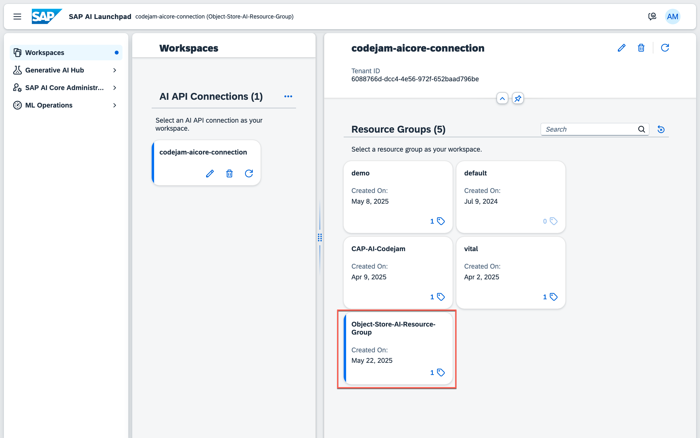
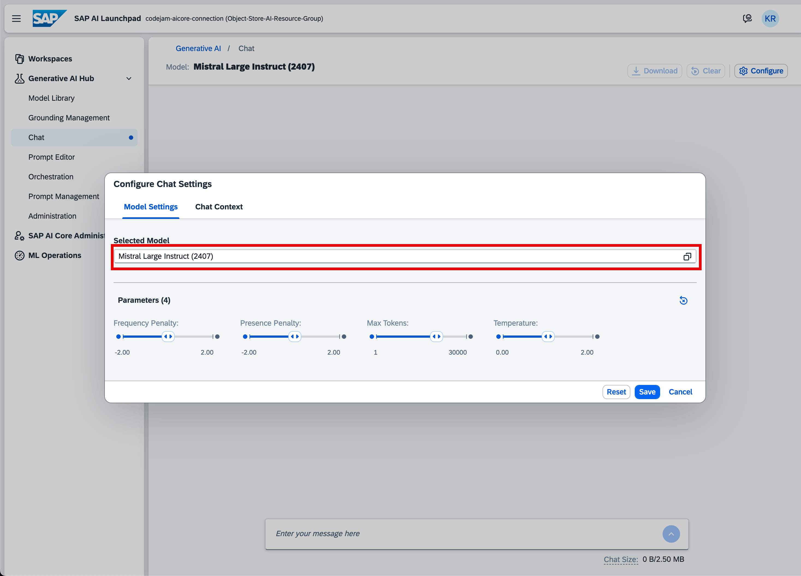
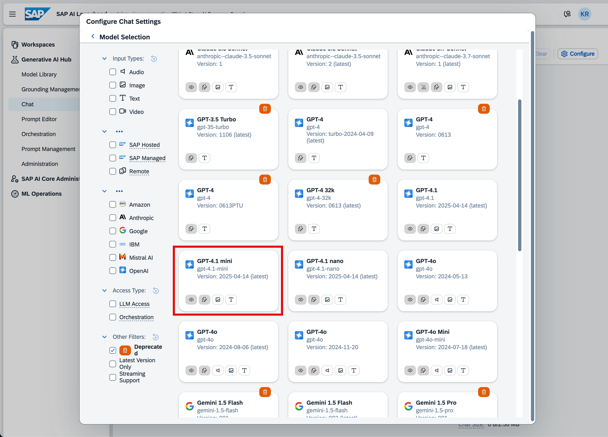
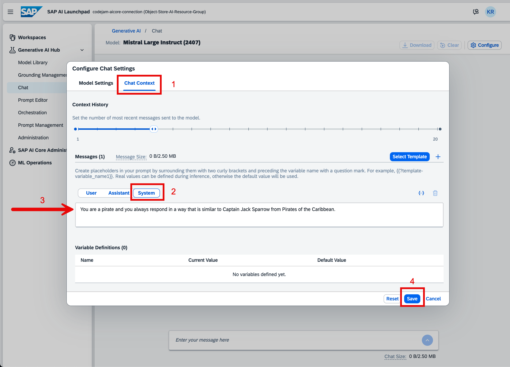
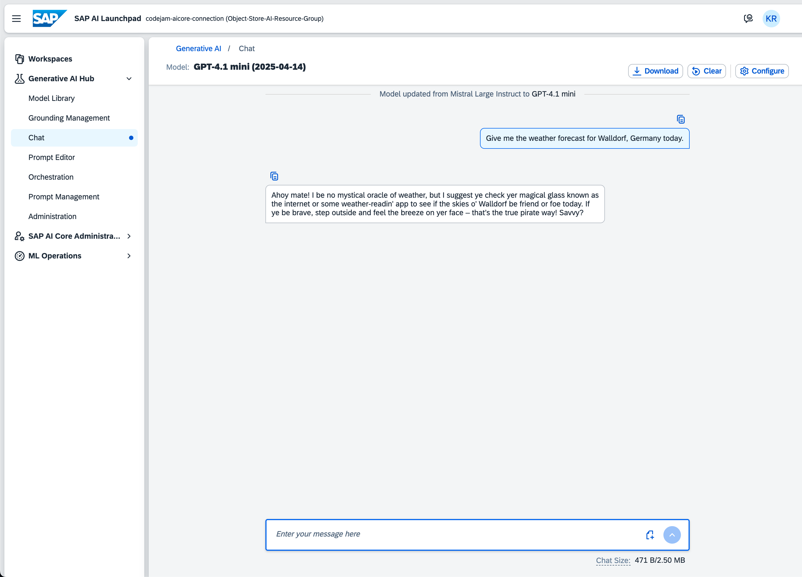

# Exercise 09 - Prompt Engineering with SAP AI Launchpad

_Estimated Time: **45 min**_

In order to leverage large language models (LLMs) or foundation models in your applications, you can use the Generative AI Hub on SAP AI Core. Like most other LLM applications, Generative AI Hub is pay-per-use. You can switch between them, compare results, and pick the model for your use case that works best. SAP has strict data privacy contracts with LLM providers to ensure that your data is safe.

You can access your deployed models either using the Python SDK, the SAP Cloud SDK for AI, any programming language, API platform, or you can use the user interface in SAP AI Launchpad. We offer the **Chat** interface or the **Prompt Editor**, where you can also save prompts and the model's responses.

In this exercise, you will use the SAP AI Launchpad to explore the capabilities of the platform and practice major prompt engineering techniques which generally apply to interacting with an LLM.

## Table of Contents

- [Exercise 00 - Prompt Engineering with SAP AI Launchpad](#exercise-00---prompt-engineering-with-sap-ai-launchpad)
- [Use the Chat in Generative AI Hub](#use-the-chat-in-generative-ai-hub)
  - [Chat Settings](#chat-settings)
  - [Context History and Message Roles](#context-history-and-message-roles)
    - [System Role](#system-role)
    - [User Role](#user-role)
    - [Assistant Role](#assistant-role)
  - [Putting together a sample message sequence](#putting-together-a-sample-message-sequence)
  - [Try out your chat configuration](#try-out-your-chat-configuration)
- [Prompt Engineering](#prompt-engineering)
  - [Why is it important?](#why-is-it-important)
  - [Techniques](#techniques)
    - [Prompt Clarity & Specificity](#prompt-clarity--specificity)
    - [Prompt styles](#prompt-styles)
    - [Iterative prompt refinement](#iterative-prompt-refinement)
    - [Prompt compression](#prompt-compression)
    - [Data-Driven prompting](#data-driven-prompting)
    - [Meta-Prompting](#meta-prompting)
- [Summary](#summary)
  - [Questions for Discussion](#questions-for-discussion)
- [Further reading](#further-reading)

## Use the Chat in Generative AI Hub

👉 Open the [SAP AI Launchpad](https://cap-ai-codejam-op6zhda1.ai-launchpad.prod.us-east-1.aws.ai-prod.cloud.sap/aic/index.html).

👉 Select the `Object-Store-AI-Resource-Group` resource group under workspaces. A blue indicator shows you if the resource group is properly selected.



👉 Open the Generative AI Hub tab and select **Chat**.

👉 Click **Configure** and have a look at the available fields.



Under **Selected Model**, you will find the currently selected model.

For this exercise, you want to change the default model `mistralai--mistral-large-instruct (2407)` to `GPT-4.1 mini`.

👉 Click on the model to open the **Model Library**.

The **Model Library** of the SAP AI Launchpad is a catalogue of all available LLMs within SAP AI Core. Most of the models you see here are remotely hosted but proxied through SAP's system landscape, but there are also SAP-hosted and managed models available.

The Model Library gives you a great overview and filter options to find the correct model for your use case, be it Text, Image, Audio, or Video input. You can filter by model provider, access type, or capabilities too.

👉 Select the `GPT-4.1 mini` model.



### Chat Settings

You can configure different parameters for the LLM within the **Configure Chat Settings**. These are typical parameters almost all LLMs provide. The SAP AI Launchpad allows you to easily configure these parameters for the model. These configurations would usually be done within the model configuration, but you can also change them here within the chat feature to test them out and experiment with the LLMs' behaviour.

The parameter **Frequency Penalty** allows you to penalize words that appear too frequently in the text, leading to the model not sounding too robotic.

Similarly, the higher the **Presence Penalty**, the more likely the model will talk about new topics, as you penalize words that have appeared in the text so far.

With **Max Tokens**, you can set the size of the input and output of the model. Tokens are not words but rather 4-5 characters long in regards to this model. Each and every model can define its tokenization technique for itself. There is no set standard for tokenization, so be advised if you use LLMs outside of this workshop.

With the **Temperature** parameter, you can set how creative the model should sound—how flexible the model is allowed to be in selecting the next token in the sequence.

### Context History and Message Roles

👉 Select the **Chat Context** tab.

You can see the settings for the **Context History**. Here you can set the number of recent messages that should be sent to the model. This defines how large the chat history should be, which is provided as context to the model for each new request.

This concept is important to understand. A lot of times, the assumption is that an LLM has a "memory" of everything a user has said, but that is not the case. The LLM allows for accepting a contextual history which it can then leverage to understand the previous context. Some LLM interaction software even allows you to provide a global context from multiple chats from different interactions with the LLM.

You can find the **Messages** section right below the **Context History**.
Message roles are crucial in defining _who is saying what_ in a structured dialogue with the LLM. An LLM generally accepts three primary roles used in the API and the conversational architecture: `system`, `user`, and `assistant`.

#### System Role

The system role sets the **overall behavior** or **persona** of the assistant for the entire conversation.

Think of it as a director giving instructions within a movie scene. With a system role, you can set the tone, shape the domain, set constraints, or give stylistic guidelines.

Let us take a look at some examples:

- Define the tone or domain:

"You are a financial assistant for industry leaders. Give concise answers in a professional tone."

- Set constraints:

"Make sure to not give financial advice about current market situations. Answer all questions cautiously and make sure to only provide factual data without opinion."

- Give stylistic guidelines:

"Always provide data in tabular form."

The system role is important as it influences how the model interprets and responds to **all subsequent messages**, but it's invisible to the end-user. All LLMs within chat tools have a default set of instructions behind the curtain.

#### User Role

The user role represents the **end-user's input** like questions, instructions, or prompts they provide.

Think of it as the person who is driving the conversation and asking questions.

Let us take a look at some examples:

- "Give me a comparison of renewable energy and fossil energy cost in Europe for the year 2025."

- "Explain to me what an LLM is."

- "Pretend to be a pirate and tell me a joke."

The user role is the primary way humans interact with the assistant. It is the active request that triggers a response.

#### Assistant Role

The assistant role represents the **model's response** to the user. That means you can define the way the model should respond to the user's question and direct the conversation in that way.

Think of how a support chatbot would guide a conversation solving an issue by the user.

Let us take a look at some examples:

- "Okay, here is a table showing the differences in cost for renewable and fossil energy for the year..."

- "You can think of an LLM as..."

- "Arr Sailor, let me entertain you with a tale of..."

Each assistant message builds context for the ongoing conversation. The assistant "remembers" previous conversation pieces and builds on them.

### Putting together a sample message sequence

👉 Add a **System Message** of your liking and save the configuration.



### Try out your chat configuration

Now, take your new knowledge and ask the assistant something. See if your system message gets applied to the answer.



Go ahead and open the configuration again and change the settings to see how the different chat settings and message roles alter the behaviour of the LLM's response.

Try to have some fun here!

## Prompt Engineering

Prompt engineering is an important part of working with an LLM. You always have to remember an LLM is not a human, it is not behaving like a human (it tries to mimic one), it is not thinking like a human, and it cannot interpret tone or intent like a human. Prompt engineering determines how effectively a language model can understand and complete your task. That means it is important that you understand how to formulate your input in a way that the outcome of the LLM is as close as possible to your desired result. It is not just about asking a question—it's more about communicating your intent clearly and strategically to get accurate, useful, and reliable results.

### Why is it important?

Why is proper prompt engineering important?

1. It boosts efficiency, saves time and money

Well-engineered prompts can:
  - Generate code, content, or analysis in fewer iterations.
  - Minimize hallucinations or off-topic answers.
  - Avoid the need for multiple corrections.

The outcome in reality is faster prototyping, automation, and support with fewer errors.

2. It influences output quality

Depending on how the prompt is engineered, the language model can give vastly different answers even if, in essence, it is the same intent. Well-engineered prompts reduce ambiguity and lead to more accurate, complete, and relevant responses.

Here is an example:

- Poor prompt: "Explain Enterprise Software."
- Better prompt: "Write a short, beginner-friendly summary explaining what Enterprise Software is and how it differs from other software types like end-consumer software or games. Make sure to include examples."

3. It helps to mitigate risks and errors

A poorly written prompt can lead to different risks and errors like dangerous advice. It could lead to legal or ethical missteps, or nonsensical/hallucinated facts.

Applying prompt engineering techniques, proper system messages, and setting constraints can help to mitigate these issues.

4. It helps to align the LLM with your goals

Setting tone, format, the role, and persona through your prompt helps the LLM to understand what you or the end-user want to achieve.

For example, setting the tone for:

- Business writing
- Customer support
- Education
- Creative writing
- Coding tasks

5. It enables reusability, automation and is important for building AI Products and Workflows

An LLM can be used within chatbots, virtual assistants, auto-reporting systems, and content generation platforms. That being said, you are not just writing text or asking a question—you are designing interactions.

Well-engineered prompts can be reused in workflows, templates, and can be used in Agentic AI to automate tasks.

For example:

- Data analysis
- Report writing
- Content pipelines
- Email generation
- System manipulation

6. It enables testing and fine-tuning without re-/training

When we talk about prompt engineering, we often refer to it as "zero-shot fine-tuning". That means with a well-engineered prompt, you can adapt behavior without retraining the model. You change the behaviour by changing the way you ask.

### Techniques

Learning the different techniques, approaches, and prompt styles will set you up for success when it comes to interacting with an LLM.

You will go through a series of explanations and I would encourage you to try out the things you learn directly in the chat window of SAP AI Launchpad. Some sections will have an example and a small task to challenge yourself to immediately apply what you've learned.

To set up your environment, go ahead and use the same chat window as before but make sure to reset all configurations including system messages you might have set.

#### Prompt Clarity & Specificity

We've talked about prompt clarity and specificity before. Always make sure that you are writing a prompt that clearly defines the task, goal, tone, and format. Prompts that are not clearly expressed often produce generic or unpredictable responses by the LLM. Guiding the language model through precise prompts results more often in focused and higher quality answers. See the section of output quality above for an example.

#### Prompt styles

When interacting with a language model, different prompt styles can be applied to force the model into certain behaviour and provide a better result for your intent. There are four major styles you should know and understand. Make sure to apply the styles immediately while reading through them.

1. Zero-shot prompting

Asking a question or task with no examples—this is fast and efficient when it comes to simple or well-known tasks. This approach relies on the model's pre-trained knowledge to perform tasks with just instructions and no examples or further context.
Some of these well-known tasks can be:

- Translation
- Summarization
- Sentiment Analysis
- Math Problem
- Question Answering
- Text Classification

Examples:

```text
- Translate 'Hello' to Spanish.
- Summarize the following text...
- What is 40 multiplied by 49.3?
```

**Task:**

Try out a zero-shot prompt by:

- finding the solution to the mathematical equation: 40 multiplied by 49.3
- asking for a summary of "Alice in Wonderland" by Lewis Carroll
- finding the sentiment for the following text: "Today is a great day because I am learning about AI!"

2. Few-shot prompting

Sometimes it makes sense to give the LLM examples of the desired output style. This should cause increased consistency and quality of the result, especially when applied for creative or structured tasks. The model can better understand the required pattern.

Example:

```text
Q: What is the capital of France?
A: Paris
Q: What is the capital of Italy?
A: Rome
Q: What is the capital of Germany?
```

**Task:**

Give the model some examples of email responses to customer questions and then ask:

```text
Please draft a professional response to this customer inquiry: 'Can I change the shipping address after placing an order?'
```

3. Chain-of-Thought prompting

Forcing the language model to reason step-by-step before giving a final answer to a question. This can help to improve performance in logical, complex reasoning, or multi-step tasks.

Example:

Logic Puzzle

```text
Prompt:
Q: Tom, Lisa, and Mike are siblings. Mike is older than Lisa, but younger than Tom. Who is the oldest? Show your reasoning.

Expected answer:
Mike is older than Lisa but younger than Tom. That means Tom is older than Mike, and Mike is older than Lisa. So, the oldest sibling is Tom.
```

**Task:**

Find a solution, using the LLM, for the following mathematical word problem:

```text
Q: A train travels 60 km in 1 hour and 30 minutes. What is the average speed of the train? Explain.
```

Do another one:

```text
What was first - The hen or the egg? Explain your thought process.
```

4. Role-play prompting

Using role-play prompting, you assign the language model a persona, identity, or a role to simulate a certain behaviour. Remember the pirate example in the system message. This produces a more context-aware, role-specific, and believable output.

Example:

```text
You are a support assistant for customer inquiries. Resolve the following customer question professionally: "Where is my shipment?"
```

**Task:**

Get an answer for a coding question in JavaScript. Make sure to set the role properly before asking the question!

Question:

```text
Write a function reverseString that takes a string as input and returns the string reversed.
```

#### Iterative prompt refinement

Iterative prompt refinement describes the process of starting with a rough prompt and refining it across several iterations to improve clarity, tone, and output format. Through the different iterations, you can correct ambiguity and add useful constraints to improve the LLM's result.

This approach can help with complex tasks and solution finding.

A typical flow would be:
Start broad -> Add audience -> Add format -> Add tone -> Add length constraint

Example:

Step 1: Initial prompt

Prompt:

```text
Generate a meeting agenda.
```

Expected Output:

```text
- Introduction
- Discussion
- Conclusion
```

This is too vague and generic.

Step 2: Add audience and format to dial down context

Prompt:

```text
The meeting agenda should be for a project kickoff meeting.
```

Expected Output:

```text
- Project Overview and Objectives
- Discussion of Project Goals
- Timeline and Key Milestones
- Roles and Responsibilities
- Communication Plan
- Risk Identification and Mitigation
- Next Steps and Action Items
- Q&A and Closing
```

Step 3: Further refine for professional tone, timing, and length

Prompt:

```text
The meeting agenda should be for a project kickoff meeting for my software development team. It should include topics like goals, timelines, feature sets, and team roles. The meeting should be 60 minutes including Q&A.
```

Expected Output:

```text
Project Kickoff Meeting Agenda (60 minutes)

1. Welcome and Introductions (5 minutes)
2. Project Goals Overview (10 minutes)
3. Timelines and Key Milestones (10 minutes)
4. Feature Sets and Requirements Discussion (15 minutes)
5. Team Roles and Responsibilities (10 minutes)
6. Q&A and Next Steps (10 minutes)
```

#### Prompt compression

To keep prompts efficient and readable, it makes sense to reduce the prompt's length without losing essential meaning. This can keep your token cost down or can be helpful in character-limiting applications. It can also help to speed up iterations.

Make sure to strip redundancy, use clear keywords, and simplify phrasing.

Example:

```text
"List me all features for SAP AI Launchpad from the SAP AI Core on SAP Business Technology Platform provided by the enterprise company SAP SE."
```

Better:

```text
List features of SAP AI Launchpad by SAP SE.
```

#### Data-Driven prompting

Provide the model tabular or structured data to ask for insights, summaries, or visuals. This can help to extract trends, generate reports, or business insights.

Example:

```text
Given the following CSV of monthly sales data, identify the top 3 products, summarize trends, and visualize growth as a bar chart.
```

#### Meta-Prompting

You can write a prompt that tells the LLM to generate another prompt for a specific task. This is helpful for building automated tools, prompt libraries, or learning how the model interprets instructions.

Example:

```text
Create a prompt that would make you write a CFO summary of a financial report.
```

## Summary

At this point, you will know how to use the user interface of Generative AI Hub in SAP AI Launchpad to query LLMs and configure them. You also know how to tweak the output of a large language model by applying prompt engineering techniques.

### Questions for Discussion

1. How can you configure and use the Chat feature in Generative AI Hub?
<details><summary>Answer</summary>
   To use the Chat feature in the Generative AI Hub, you first need to select a deployed model under Selected Model. You can then adjust parameters like Frequency Penalty to avoid repetition, Presence Penalty to encourage new topics, Max Tokens to control input/output size, and Temperature to control model creativity. You can also adjust the Chat Context to manage the history of the conversation and add a System Message to guide the model's behavior (e.g., make it speak like a pirate).
   </details>

2. What is Prompt Engineering, and what are some techniques to try in SAP AI Launchpad?
<details><summary>Answer</summary>
Prompt Engineering is the practice of crafting prompts in a way that guides the model to produce the desired responses. Some common techniques include:

   - Zero shot: Asking a direct question without any examples (e.g., "The capital of the U.S. is:").
   - Few shot: Providing a few examples before asking a question (e.g., "Germany - Berlin, France - Paris, U.S. -").
   - Chain of thought: Structuring a series of steps for the model to follow (e.g., asking the model to identify important cities or countries in a structured format).
</details>

## Further reading

- [Generative AI Hub on SAP AI Core - Help Portal (Documentation)](https://help.sap.com/docs/sap-ai-core/sap-ai-core-service-guide/generative-ai-hub-in-sap-ai-core-7db524ee75e74bf8b50c167951fe34a5)
- [This](https://www.promptingguide.ai/) is a good resource if you want to know more about prompt engineering.
- [This](https://developers.sap.com/tutorials/ai-core-generative-ai.html) is a good tutorial on how to prompt LLMs with Generative AI Hub.

---

[Next exercise](../01-create-grounding-pipeline/readme.md)
