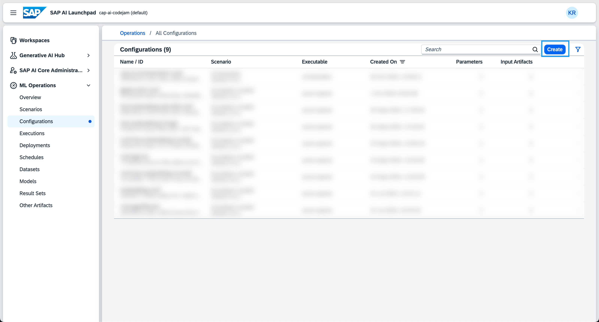
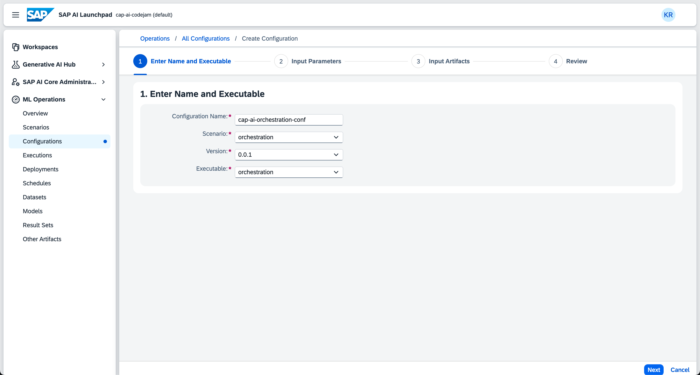
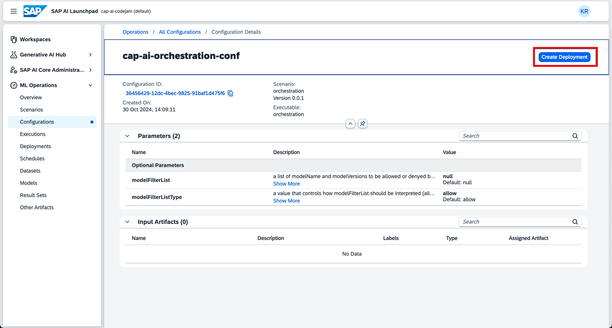
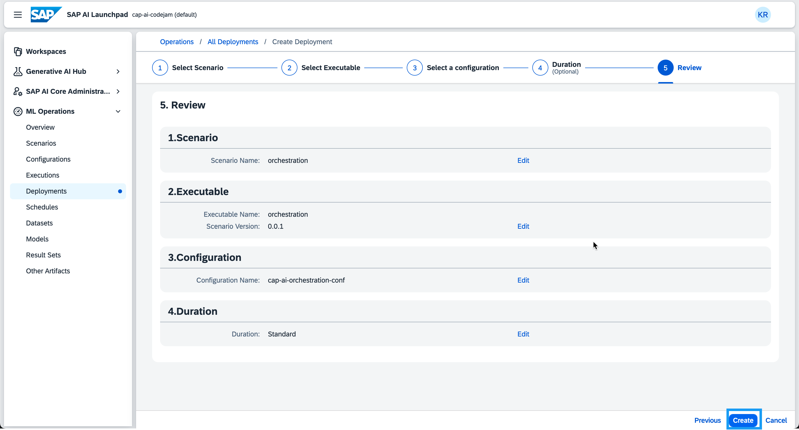
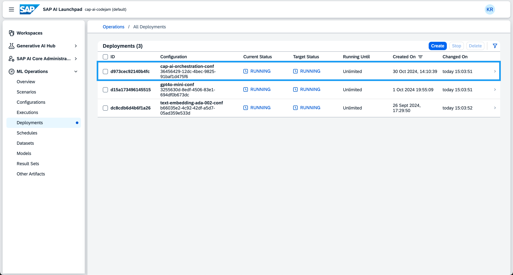
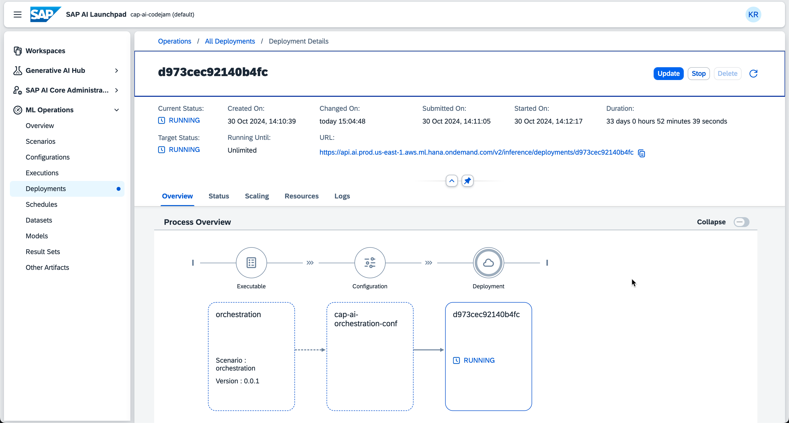

<link rel="stylesheet" href="../../assets/style.css">
# Exercise 08 - Understand and deploy the orchestration model

The orchestration service pf SAP AI Launchpad provides you with an orchestration model you can deploy and use with the SAP Cloud SDK for AI. Orchestration in the sence of AI is the combination of content generation via an LLM with a set of functions that are often required. Such functions can be templating, content filtering and data masking. In the previous exercises you have implemented a complete RAG flow using an embedding, and chat model connecting to them using a respective client. Using the orchestration service, you will use an orchestration client to establish connection to complete the RAG flow. The orchestration client allows you to add the aforementioned functions in an intuitive matter.

**Templating:** Allows you to compose a prompt with placeholders that are filled during inference.
**Content Filtering:** Allows you to restrict the type of content that is passed to and received from the generative AI model. This can also be done in the SAP AI Launchpad directly.
**Data Masking:** Allows you to mask data via anonymization or pseudonymization before passing it into a generative AI model. In case of pseudonymization maksed data present in the generative AI model response will be unmasked.

SAP tries to provide a general global filter on SAP models to ensure a certain degree of safety but you are still responsible to filter content that is innappropriate in our modern days. Data masking is completely your responsibility to ensure GDPR compliance or any other data privacy regulation. Where you manage both of these is up to you, it can be done in the SAP AI Launchpad or via the orchestration service API in the SAP Cloud SDK for AI.

In this exercise, you will learn the following:

- How to create a orchestration configuration.
- Hot to deploy an orchestration model.
- What templating, content filtering and data masking means.

## Create an orchestration configuration

Like any other deployment in SAP AI Launchpad, the orchestration model needs a configuration before deployment. The configuration defines the boundaries of that model deployment like version, executable, and scenario. The orchestration configuration can be created via the **Operations** screen.

👉 Open the SAP AI Launchpad via [SAP AI Launchpad - CAP AI Codejam](https://cap-ai-codejam-op6zhda1.ai-launchpad.prod.us-east-1.aws.apps.ml.hana.ondemand.com/aic/index.html#/workspaces&/a/detail/TwoColumnsMidExpanded/?workspace=cap-ai-codejam&resourceGroup=default)

👉 Make sure that you are set for your resource group under the <b>Workspaces screen</b>.

👉 Navigate to <b>ML Operations</b>.

👉 Open the <b>Configurations</b> screen.

👉 Click on <b>Create</b> to create a new configuration.

A new configuration creation workflow opens. In there give the configuration a name of your choice and fill in the following values:

- **Scenario:** orchestration
- **Version:** 0.0.1
- **Executable:** orchestration

👉 Click on <b>Next</b>.

👉 Go through the workflow without changing anything until you reach the <b>Review</b> step. Click on <b>Create</b>.

## Create an orchestration deployment

The configuration is now being created. After the successful creation of the configuration, you will see the configuration details. You can see the <b>Create Deployment</b> button on the top-right corner.

👉 Click the <b>Create Deployment</b> button to start the workflow.

👉 Click through the workflow until you reach the <b>Review</b> step and create the deployment.

## Review your deployment

You can review your orchestration deployment in the <b>Deployments</b> screen.

👉 Navigate to the <b>Deployments</b> screen.

👉 Review your orchestration deployment.

## Summary

In this exercise you have created a deployment for orchestration. This deployment can now be used to create an orchestration workflow in the SAP AI Launchpad or via the SAP Cloud SDK for AI.

You have learned about why such an orchestration workflow can be helpful to ease the use of templating, data masking and content filtering.

In the next exercise you will learn how to use the SAP Cloud SDK for AI to implement an orchestration workflow using the orchestration package of the SDK.

## Further Reading

- [Orchestration](https://help.sap.com/docs/ai-launchpad/sap-ai-launchpad/orchestration)
- [Harm categories in Azure AI Content Safety](https://learn.microsoft.com/en-us/azure/ai-services/content-safety/concepts/harm-categories?tabs=warning)
- [Data Masking](https://help.sap.com/docs/ai-launchpad/sap-ai-launchpad/data-masking)

---

[Next exercise](../10-implement-job-posting-serivce/README.md)