# Instructor Setup for the CodeJam

## The SAP BTP subaccount details

1. Log in the [SAP BTP Global Account: Developer Advocates Free Tier](https://emea.cockpit.btp.cloud.sap/cockpit/#/globalaccount/275320f9-4c26-4622-8728-b6f5196075f5/accountModel&//?section=HierarchySection&view=TreeTableView)

2. Navigate to the directories and subaccounts section. There you will find a folder for CodeJams. Within that is the subaccount [CAP AI CodeJam](https://emea.cockpit.btp.cloud.sap/cockpit/#/globalaccount/275320f9-4c26-4622-8728-b6f5196075f5/subaccount/6088766d-dcc4-4e56-972f-652baad796be/subaccountoverview)

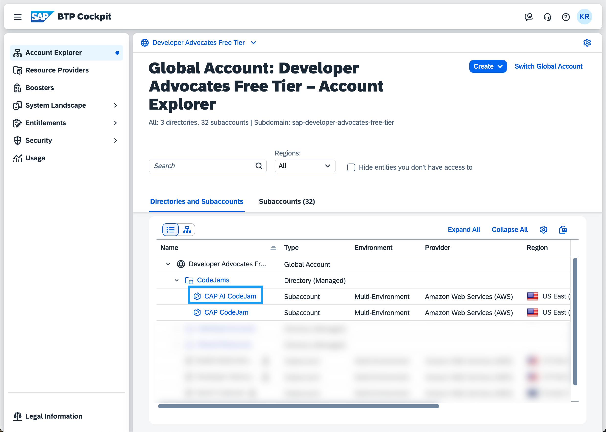

## Enable Cloud Foundry runtime environment and create a development space

1. Enable the Cloud Foundry environment via the **Enable Cloud Foundry** button.

2. Use the default enablement dialog choices

3. Once the organisation is created, create a Cloud Foundry space and name it `dev`.

4. Add the other instructors as Space Members with all roles.

## Provisioning of SAP HANA Cloud

Follow the instructions in the [SAP BTP Setup Guide](./btp-setup-guide.md) or follow the steps in the [Deploy SAP HANA Cloud - tutorial](https://developers.sap.com/tutorials/hana-cloud-deploying.html).

## Adding attendees as users

1. Navigate to the **Security** section in your subaccount.

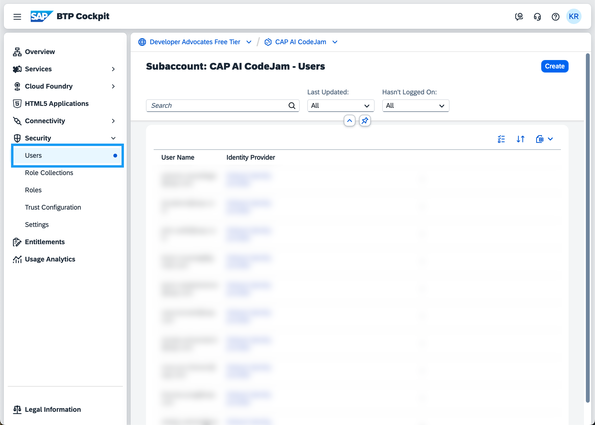

2. Create the users.

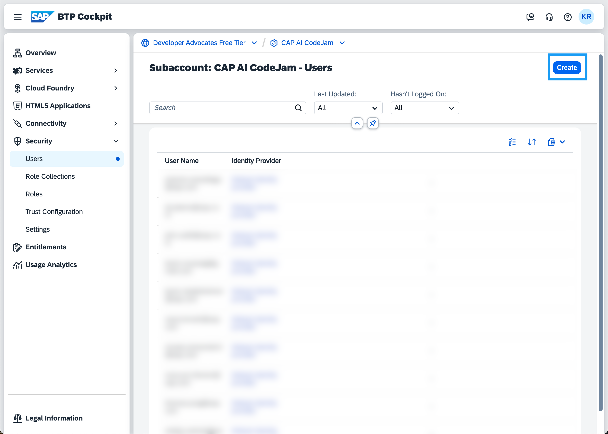

3. Enter the email address of the participant and use the `Default identity provider`.

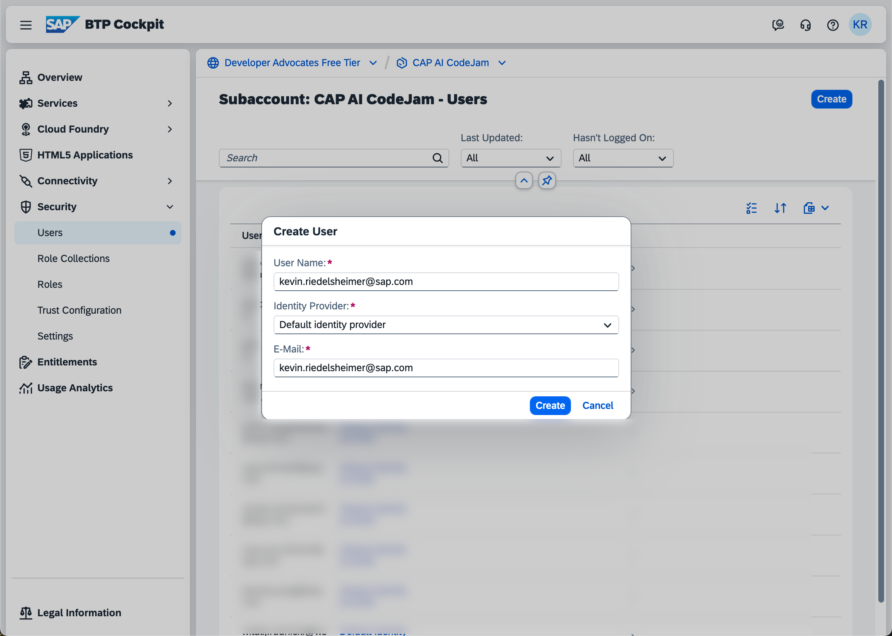

4. Assign them to the `CodeJam Participant` Role Collection.

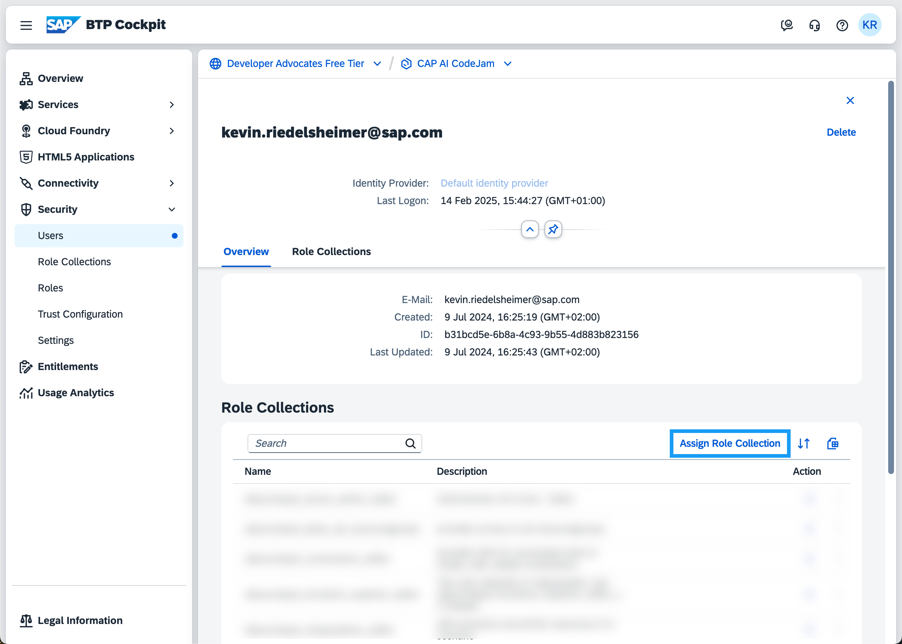

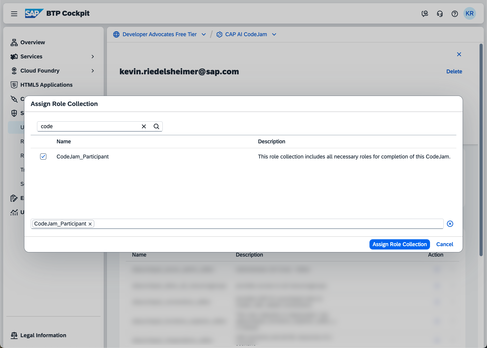

5. Assign the users to the Cloud Foundry `dev` space by navigating to the `space -> security`.

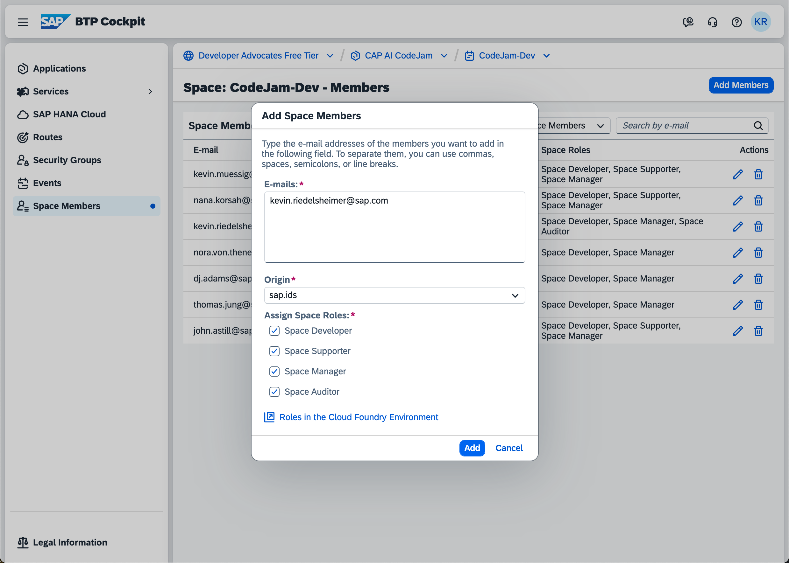

## Clean Up after the event

1. Delete all the HDI container instances from the SAP BTP cockpit subaccount/instances view.

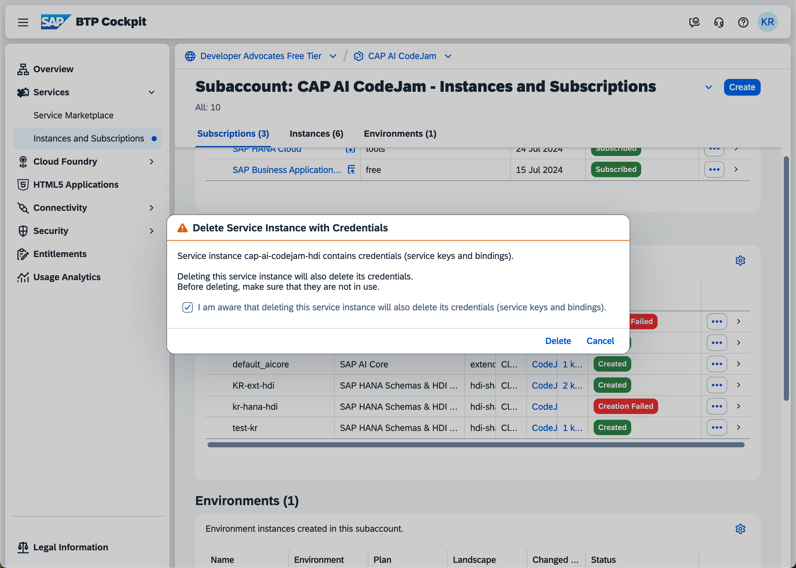

2. Disable the Cloud Foundry environment. This will remove all users access at the CF level and cleans up the remaining resources.

3. Open the SAP HANA Cloud instance.

4. Delete the SAP HANA Cloud instance.
 
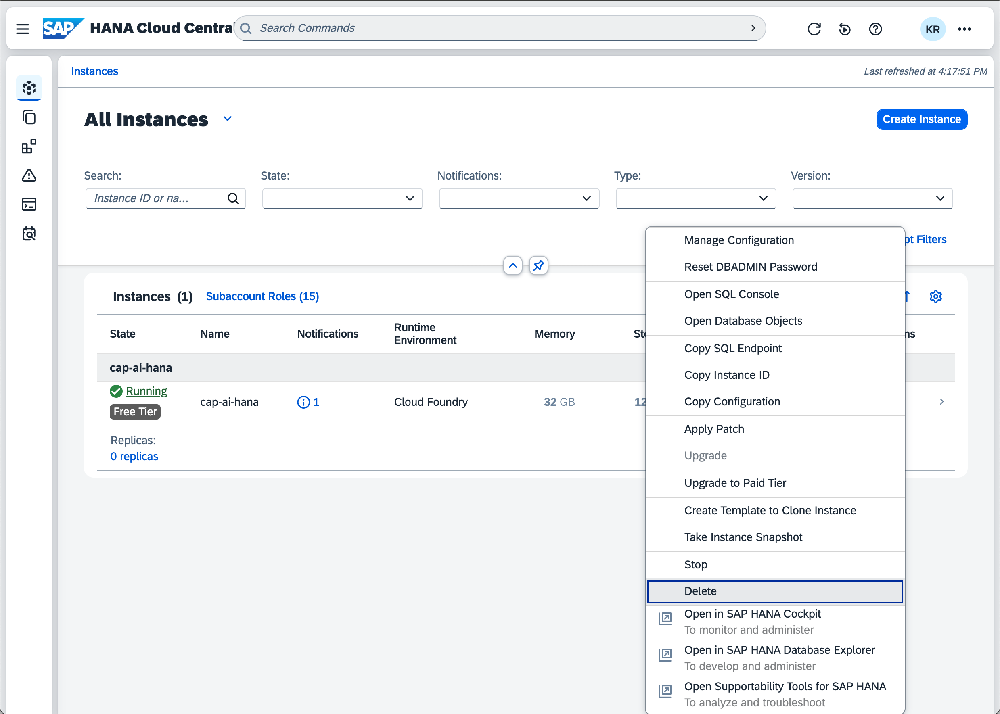

5. Remove the users from the subaccount.

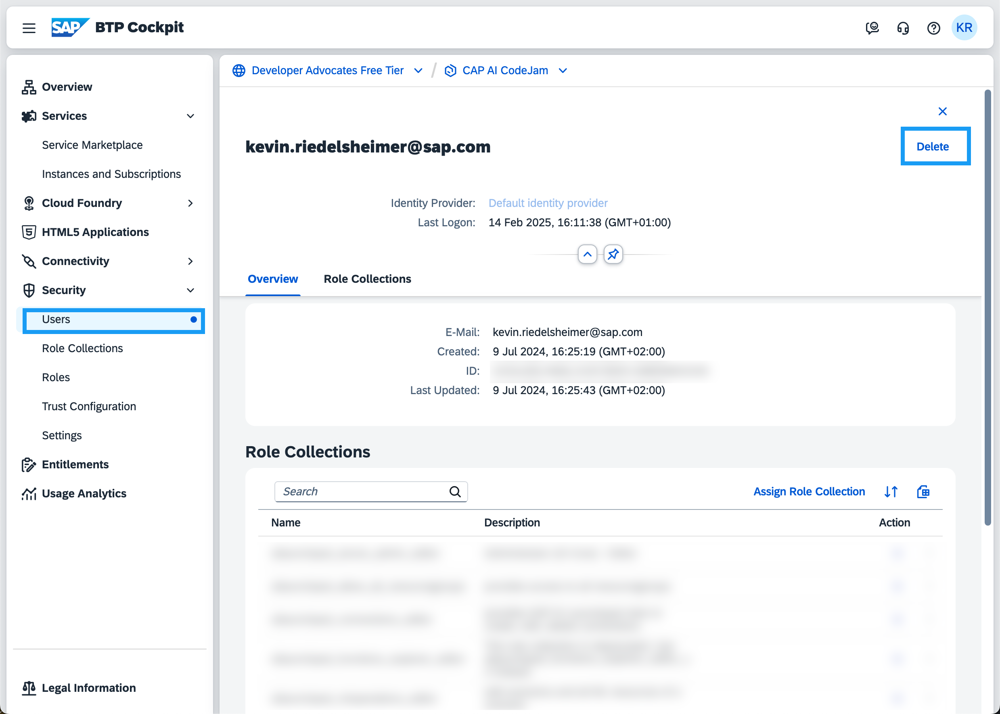

6. Delete the SAP AI Core instance.

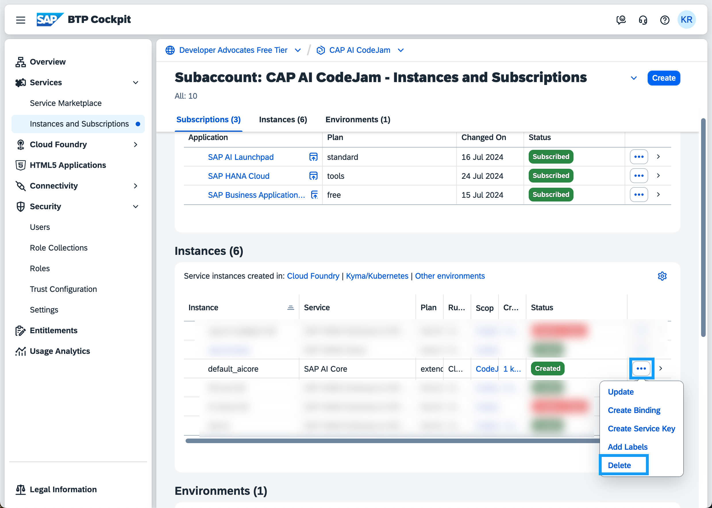

7. Delete the SAP AI Launchpad instance.

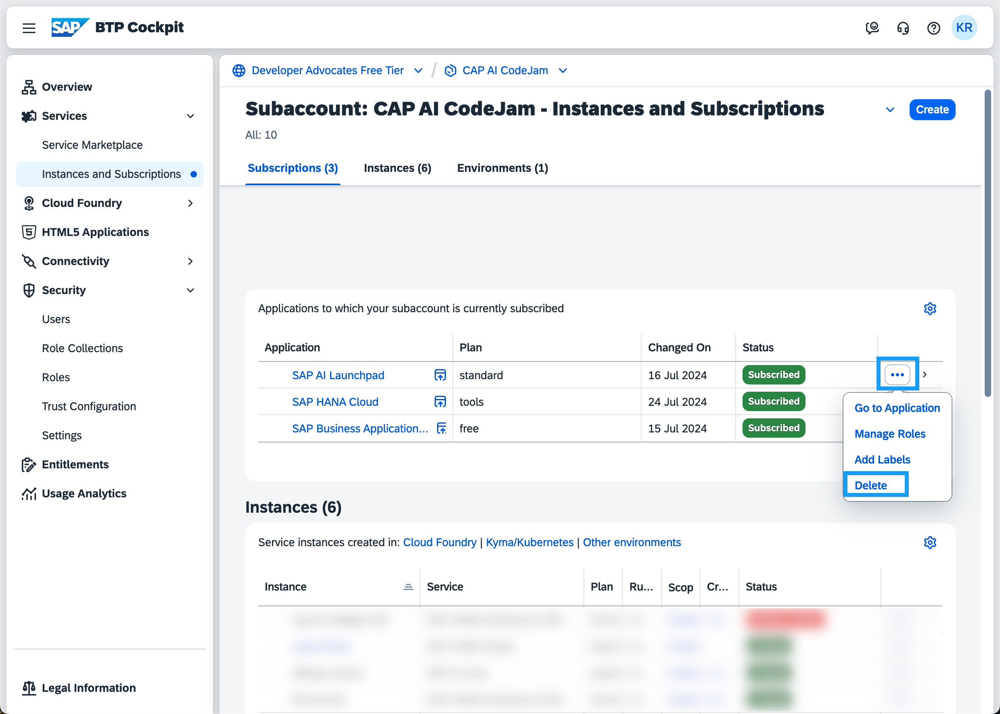