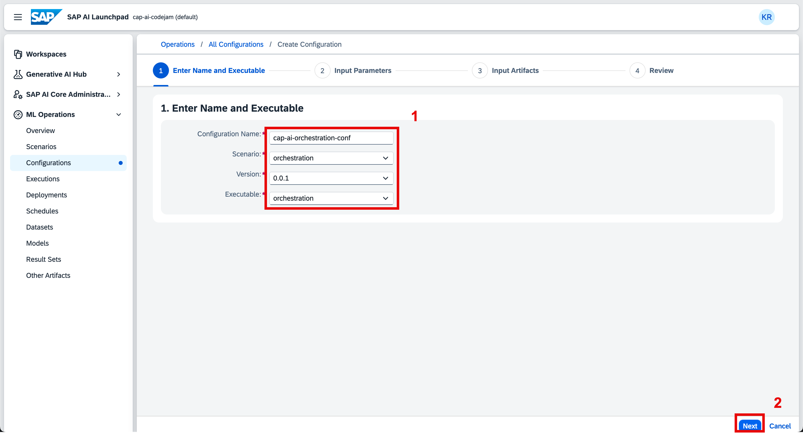

# Instructor Setup for the CodeJam

## The SAP BTP subaccount details

1. Log in the [SAP BTP Global Account: Developer Advocates Free Tier](https://emea.cockpit.btp.cloud.sap/cockpit/#/globalaccount/275320f9-4c26-4622-8728-b6f5196075f5/accountModel&//?section=HierarchySection&view=TreeTableView)

2. Navigate to the directories and subaccounts section. There you will find a folder for CodeJams. Within that is the subaccount [CAP AI CodeJam](https://emea.cockpit.btp.cloud.sap/cockpit/#/globalaccount/275320f9-4c26-4622-8728-b6f5196075f5/subaccount/6088766d-dcc4-4e56-972f-652baad796be/subaccountoverview)

## Enable Cloud Foundry runtime environment and create a development space

1. Enable the Cloud Foundry environment via the **Enable Cloud Foundry** button.

2. Use the default enablement dialog choices

3. Once the organisation is created, create a Cloud Foundry space and name it `dev`.

4. Add the other instructors as Space Members with all roles.

## Provisioning of SAP HANA Cloud

Follow the instructions in the [SAP BTP Setup Guide](./btp-setup-guide.md) or follow the steps in the [Deploy SAP HANA Cloud - tutorial](https://developers.sap.com/tutorials/hana-cloud-deploying.html).

## Adding attendees as users

1. Navigate to the **Security** section in your subaccount.

2. Create the users.

3. Enter the email address of the participant and use the `Default identity provider`.

4. Assign them to the `CodeJam Participant` Role Collection.

5. Assign the users to the Cloud Foundry `dev` space by navigating to the `space -> security`.

## Clean Up after the event

1. Delete all the HDI container instances from the SAP BTP cockpit subaccount/instances view.

2. Disable the Cloud Foundry environment. This will remove all users access at the CF level and cleans up the remaining resources.

3. Open the SAP HANA Cloud instance.

4. Delete the SAP HANA Cloud instance.
 

5. Remove the users from the subaccount.

6. Delete the SAP AI Core instance.

7. Delete the SAP AI Launchpad instance.

## Create SAP AI Launchpad Resource Group and deployments

You will provide one Resource Group on SAP AI Launchpad to the attendees. Within that Resource Group you have to create the deployments for the chat and embedding models, and the orchestration.

### Open SAP AI Launchpad

👉 Go to your BTP subaccount [**CAP AI CodeJam**](https://emea.cockpit.btp.cloud.sap/cockpit/#/globalaccount/275320f9-4c26-4622-8728-b6f5196075f5/subaccount/6088766d-dcc4-4e56-972f-652baad796be/service-instances).

👉 Navigate to **Instances and Subscriptions** and select **SAP AI Launchpad** from Subscriptions to open SAP AI Launchpad.

### Create a New Resource Group

SAP AI Core tenants use resource groups to isolate AI resources and workloads. Scenarios (e.g., `foundation-models`) and executables (a template for training a model or creating a deployment) are shared across all resource groups.

> Make sure to create a **NEW** resource group. **DO NOT USE THE DEFAULT RESOURCE GROUP!**

👉 Open the **SAP AI Core Administration** tab and select **Resource Groups**.

👉 **Create** a new resource group with the name `CAP-AI-CodeJam`.

👉 Go back to **Workspaces**.

> The creation of the Resource Group will take a minute to be created. Refresh the **Workspace** page until your Resource Group shows up.

👉 Select your connection and your resource group.

👉 Ensure it is selected. It should appear at the top next to SAP AI Launchpad.

### Create a Configuration to Deploy a Proxy for a Large Language Model on SAP AI Core

With Generative AI Hub on SAP AI Core, you have access to all major large language models (LLMs). There are open-source models that SAP has deployed, such as the Falcon model, and models that SAP is a proxy for, like the GPT models, Google models, Amazon Bedrock models, and more. To use one of the provided LLMs for a custom use case, you need to create a deployment configuration for the model. Using this configuration, you can then deploy the model. You will receive a deployment URL that you can use to query the model of your choice.

👉 Open the **ML Operations** tab.

👉 Go to **Scenarios**.

👉 Select the **foundation-models** scenario.  

Scenarios related to generative AI are the only pre-configured scenarios provided by SAP. For all other custom machine learning models you wish to train or deploy, you will need to create your own scenario.

👉 Select the **Executables** tab.

👉 Select the **serving executable azure-openai** to view the available Azure OpenAI models.

👉 Copy the name of the model you want to deploy a proxy for.

For this CodeJam, you will use `gpt-4o-mini`. After that, you will create a configuration.

👉 Click on **Configurations**.

👉 **Create** a new configuration.

👉 Enter a configuration name, e.g., `conf-gpt-4o-mini`, select the **foundation-models** scenario, version, and the executable **azure-openai**.

👉 Click **Next**.

👉 Paste the model name `gpt-4o-mini` into the **modelName** field and click **Next**.

👉 Click **Review** at the bottom of the page.

👉 Review the configuration and click **Create**.

### Deploy a Proxy for a Large Language Model on SAP AI Core

👉 Click on **Create Deployment** to create a deployment for that configuration.  

This will not actually deploy the model but will deploy a proxy that will return a URL for you to use to query the LLM you specified in the configuration.

👉 For the duration, select **Standard**.  

You can also select **Custom** to have the deployment available for a limited time.

👉 Click **Review**.

👉 Click **Create**.

The deployment status will change from `UNKNOWN` to `PENDING`, then to `RUNNING`. Once the deployment is running, you will receive a URL to query the model. Wait a couple of minutes, then **refresh** the page for the URL to appear.

Using the `URL`, `client id`, and `client secret` from the SAP AI Core service key, you can now query the model using any programming language or API platform.

### Deploy a Proxy for an Embedding Model on SAP AI Core

👉 To implement a retrieval-augmented generation (RAG) use case, we also need to deploy an embedding model. The embeddings for our text chunks will then be stored in a vector database (e.g., [SAP HANA Cloud Vector Engine](https://help.sap.com/docs/hana-cloud-database/sap-hana-cloud-sap-hana-database-vector-engine-guide/sap-hana-cloud-sap-hana-database-vector-engine-guide)).

To deploy the embedding model, create another configuration and proxy deployment using the model name `text-embedding-3-small` instead of `gpt-4o-mini`. This will create an embedding model proxy within generative AI Hub.

Follow the steps from the previous chapters of this exercise:

- **Create a Configuration to Deploy a Proxy for a Large Language Model on SAP AI Core**
- **Deploy a Proxy for an Embedding Model on SAP AI Core**

### Create an orchestration configuration

Like any other deployment in SAP AI Launchpad, the orchestration model needs a configuration before deployment. The configuration defines the boundaries of that model deployment like version, executable, and scenario. The orchestration configuration can be created via the **Operations** screen.

👉 Open the SAP AI Launchpad via [SAP AI Launchpad - CAP AI Codejam](https://cap-ai-codejam-op6zhda1.ai-launchpad.prod.us-east-1.aws.apps.ml.hana.ondemand.com/aic/index.html#/workspaces&/a/detail/TwoColumnsMidExpanded/?workspace=cap-ai-codejam&resourceGroup=default)

👉 Make sure that you are set for your resource group under the **Workspaces screen**.

👉 Navigate to **ML Operations**.

👉 Open the **Configurations** screen.

👉 Click on **Create** to create a new configuration.

A new configuration creation workflow opens. In there give the configuration a name of your choice and fill in the following values:

- **Configuration Name:** conf-orchestration
- **Scenario:** orchestration
- **Version:** 0.0.1
- **Executable:** orchestration

👉 Click on **Next**.

👉 Go through the workflow without changing anything until you reach the **Review** step. Click on **Create**.

### Create an orchestration deployment

The configuration is now being created. After the successful creation of the configuration, you will see the configuration details. You can see the **Create Deployment** button on the top-right corner.

👉 Click the **Create Deployment** button to start the workflow.

👉 Make sure to select the `Orchestration` scenario and click next.

👉 Click through the workflow until you reach the **Review** step and create the deployment.

### Review your deployment

You can review your orchestration deployment in the **Deployments** screen.

👉 Navigate to the **Deployments** screen.

👉 Review your orchestration deployment.

